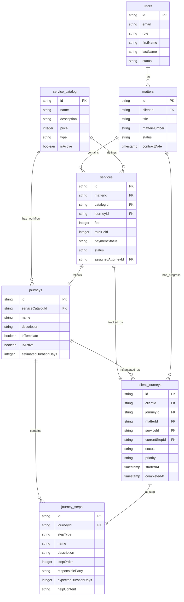

# Domain Model - Entity Relationship Diagram

**Date:** January 2026
**Purpose:** Visual representation of Matter/Service/Journey relationships

---

## Entity Relationship Diagram



---

## Key Relationships

### 1. Client → Matter (1:many)
- A client can have multiple matters (engagements/SOWs)
- Each matter belongs to one client

### 2. Matter → Service (1:many)
- A matter can have multiple services (WYDAPT + Maintenance)
- Each service belongs to one matter

### 3. service_catalog → Service (1:many)
- A product definition (catalog) can be engaged many times
- Each engaged service references one catalog item

### 4. service_catalog → Journey (1:many)
- A product can have multiple workflow templates (maybe versioning?)
- Each journey template is for one product

### 5. Service → Journey (1:1) **REQUIRED**
- Each engaged service must follow exactly one journey
- Each journey can be used by multiple services

### 6. Service → client_journey (1:1)
- Each service has exactly one progress tracker
- Each progress tracker is for one service

### 7. Matter → client_journey (1:many)
- A matter has multiple progress trackers (one per service)
- Each progress tracker belongs to one matter

### 8. Journey → journey_steps (1:many)
- A journey has multiple steps
- Each step belongs to one journey

### 9. client_journey → journey_step (many:1)
- Multiple clients can be at the same step
- Each client_journey is at one current step

---

## Example Data Flow

### Scenario: Smith family engages WYDAPT service

```
1. Client exists:
   users { id: "client-123", email: "smith@example.com", role: "CLIENT" }

2. Matter created:
   matters {
     id: "matter-456",
     clientId: "client-123",
     title: "Smith Family Trust 2024",
     matterNumber: "2024-001"
   }

3. Service engaged:
   services {
     id: "service-789",
     matterId: "matter-456",           ← Links to matter
     catalogId: "catalog-wydapt",      ← Which product (WYDAPT)
     journeyId: "journey-wydapt-v1",   ← Which workflow (1:1)
     fee: 1500000,                     ← $15,000
     paymentStatus: "UNPAID",
     status: "PENDING"
   }

4. client_journey created:
   client_journeys {
     id: "cj-999",
     clientId: "client-123",           ← Who
     matterId: "matter-456",           ← Which engagement
     serviceId: "service-789",         ← Which service
     journeyId: "journey-wydapt-v1",   ← Which workflow
     currentStepId: "step-1",          ← Where they are
     status: "IN_PROGRESS"
   }
```

---

## Current vs. Proposed Schema

### Current Issues:

1. ❌ `client_journeys` missing `matterId`
2. ❌ `client_journeys` missing `serviceId`
3. ⚠️ `services.journeyId` is optional (should be required for 1:1)

### Proposed Fixes:

```sql
-- Add missing foreign keys to client_journeys
ALTER TABLE client_journeys
  ADD COLUMN matter_id TEXT REFERENCES matters(id) ON DELETE CASCADE;

ALTER TABLE client_journeys
  ADD COLUMN service_id TEXT REFERENCES services(id) ON DELETE CASCADE;

-- Make services.journeyId required (after backfilling data)
-- UPDATE services SET journey_id = ... WHERE journey_id IS NULL;
-- ALTER TABLE services ALTER COLUMN journey_id SET NOT NULL;
```

---

## Questions to Validate

1. **Can a service exist without a journey?**
   - Current: Yes (journeyId is optional)
   - Proposed: No (1:1 required)
   - Is this correct?

2. **Can a client_journey exist without a service?**
   - Current: Yes (no serviceId)
   - Proposed: No (should always be for a specific service)
   - Is this correct?

3. **Can one service have multiple client_journey records?**
   - Example: Client retries/restarts the journey
   - Current design: Potentially yes (no unique constraint)
   - Should we add: UNIQUE(serviceId) constraint?

4. **service_catalog vs services - still think they're redundant?**
   - service_catalog = "WYDAPT - $15,000" (product definition)
   - services = "Smith family's WYDAPT in Matter #2024-001" (instance)
   - These are different things - keep both?
