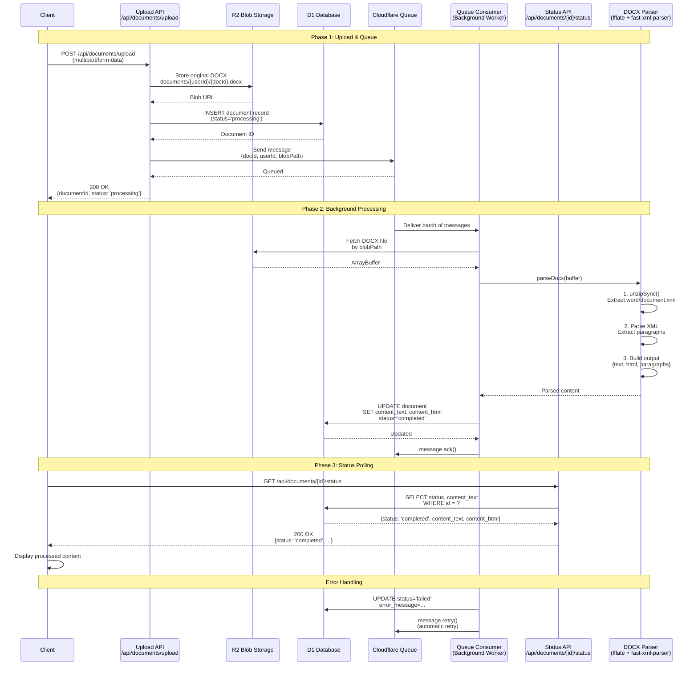
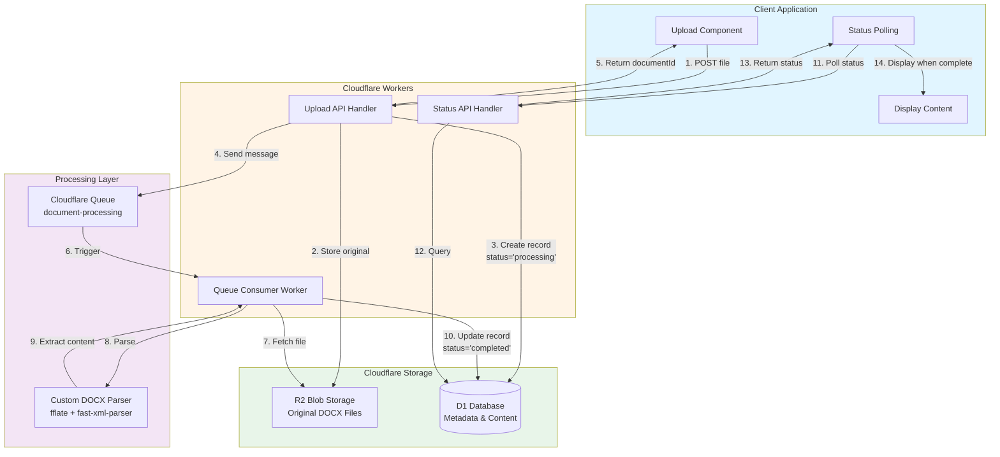
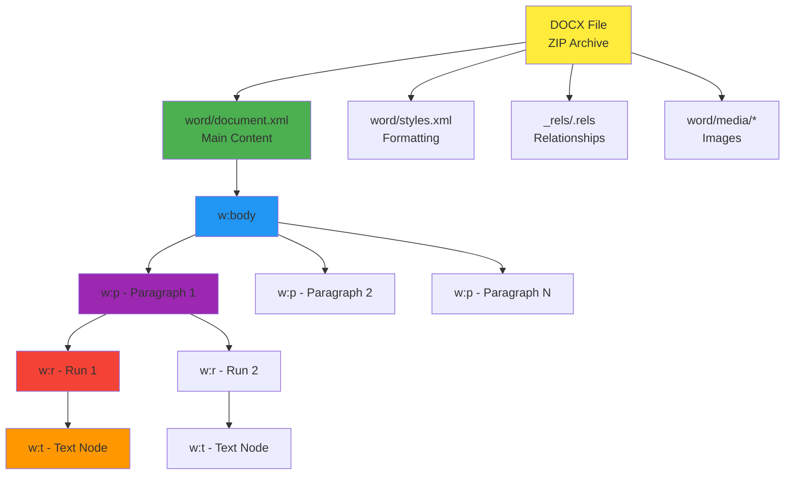

# DOCX Processing Architecture - Cloudflare Native

## Overview

This document describes the asynchronous DOCX processing architecture using Cloudflare Workers, Queues, R2, and D1.

## Architecture Diagram



## Component Flow Diagram



## Data Flow

```mermaid
graph LR
    subgraph Input
        DOCX[DOCX File<br/>80-100 pages<br/>~300KB-1.5MB]
    end

    subgraph Upload["Upload Phase"]
        R2Store[R2 Storage<br/>Original DOCX]
        DBPending[D1 Record<br/>status: processing]
        QueueMsg[Queue Message<br/>{docId, path}]
    end

    subgraph Processing["Processing Phase"]
        Unzip[fflate.unzipSync<br/>Extract ZIP]
        XML[Extract<br/>word/document.xml]
        Parse[fast-xml-parser<br/>Parse XML]
        Extract[Extract Text<br/>from w:t nodes]
    end

    subgraph Output["Output Phase"]
        Text[Plain Text]
        HTML[HTML Content]
        Metadata[Paragraph Metadata]
        DBComplete[D1 Record<br/>status: completed]
    end

    DOCX --> R2Store
    DOCX --> DBPending
    R2Store --> QueueMsg

    QueueMsg --> Unzip
    Unzip --> XML
    XML --> Parse
    Parse --> Extract

    Extract --> Text
    Extract --> HTML
    Extract --> Metadata
    Text --> DBComplete
    HTML --> DBComplete
    Metadata --> DBComplete
```

## Database Schema

### documents table

```sql
CREATE TABLE documents (
  id TEXT PRIMARY KEY,
  user_id TEXT NOT NULL,
  filename TEXT NOT NULL,
  blob_path TEXT NOT NULL,

  -- Processing status
  status TEXT NOT NULL CHECK(status IN ('processing', 'completed', 'failed')),

  -- Extracted content
  content_text TEXT,
  content_html TEXT,

  -- Error handling
  error_message TEXT,
  retry_count INTEGER DEFAULT 0,

  -- Timestamps
  created_at INTEGER NOT NULL,
  processed_at INTEGER,

  FOREIGN KEY (user_id) REFERENCES users(id) ON DELETE CASCADE
);

CREATE INDEX idx_documents_user_status ON documents(user_id, status);
CREATE INDEX idx_documents_status ON documents(status);
```

## DOCX File Structure



## Key Benefits

### 1. Asynchronous Processing
- Upload returns immediately (~100ms)
- Processing happens in background
- No timeout issues for large files

### 2. Scalability
- Queue handles 100+ concurrent uploads
- Consumer processes batches efficiently
- Automatic retry on failures

### 3. Reliability
- Guaranteed message delivery
- Automatic retries with exponential backoff
- Dead letter queue for permanent failures

### 4. Performance
- Upload: ~100-200ms
- Queue latency: ~50-100ms
- Processing 100-page doc: ~1-3 seconds
- Total user-perceived time: <200ms (async)

### 5. Cost Efficiency
- No external services
- R2: $0.015/GB storage
- Queue: Included in Workers plan
- D1: First 5GB free

## Implementation Checklist

- [ ] Install dependencies (`fflate`, `fast-xml-parser`)
- [ ] Create DOCX parser utility
- [ ] Update `wrangler.jsonc` with queue config
- [ ] Implement upload API endpoint
- [ ] Implement queue consumer
- [ ] Implement status polling endpoint
- [ ] Add database migration for documents table
- [ ] Create frontend upload component with polling
- [ ] Test with sample 100-page documents
- [ ] Add error handling and monitoring
- [ ] Deploy to production

## Alternative: Cloudflare Workflows

For even more complex processing pipelines, consider using **Cloudflare Workflows** (currently in beta):


Workflows provide:
- Up to 1024 steps per workflow
- Built-in state management
- Automatic retries and error handling
- Durable execution

## Security Considerations

1. **Authentication**: Verify user session on upload
2. **File Validation**: Check file type and size limits
3. **Path Sanitization**: Prevent path traversal attacks
4. **Quota Enforcement**: Limit uploads per user/day
5. **Virus Scanning**: Consider integration with scanning service
6. **Access Control**: Ensure users can only access their documents

## Monitoring & Observability

```typescript
// Add to queue consumer
export default {
  async queue(batch: MessageBatch, env: Env) {
    const startTime = Date.now()

    for (const message of batch.messages) {
      try {
        // Processing logic...

        // Log metrics
        console.log({
          event: 'document_processed',
          documentId: message.body.documentId,
          duration: Date.now() - startTime,
          fileSize: buffer.byteLength
        })
      } catch (error) {
        // Log errors
        console.error({
          event: 'document_processing_failed',
          documentId: message.body.documentId,
          error: error.message,
          stack: error.stack
        })
      }
    }
  }
}
```

## Future Enhancements

1. **Streaming Processing**: For very large files (>10MB)
2. **Format Preservation**: Extract tables, lists, formatting
3. **Image Extraction**: Store embedded images separately
4. **OCR Integration**: Extract text from images in documents
5. **Version Control**: Track document revisions
6. **Bulk Processing**: Process multiple documents in one upload
7. **Webhooks**: Notify external systems when processing completes
