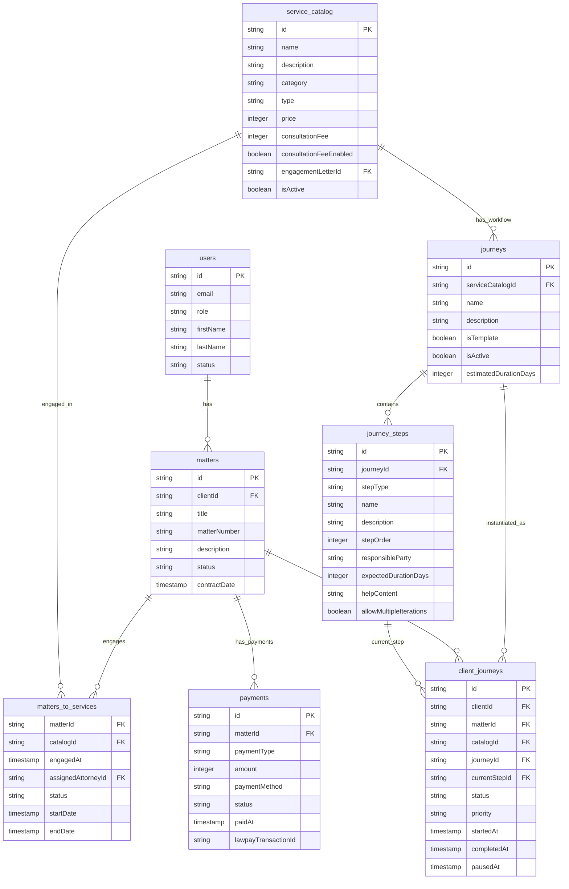

# Domain Model Restructuring - Complete Guide

**Date:** January 2026
**Status:** Implemented
**Migration:** `0011_restructure_services_to_junction.sql`

---

## Executive Summary

The domain model has been restructured to simplify the relationships between matters, services, and journeys. The key change is replacing the `services` table with a `matters_to_services` junction table and moving payment tracking to the matter level.

### Key Benefits

✅ **Clearer Relationships** - Explicit many-to-many between matters and service catalog
✅ **Simpler Payments** - All payments tracked at matter level
✅ **Better Integrity** - Composite foreign keys ensure referential integrity
✅ **Matches Business Model** - "Matter is the unit of sales"
✅ **Turnkey System** - Auto-generated matter numbers, no manual entry

---

## New Domain Model

### Entity Relationship Diagram



---

## Key Concepts

### 1. Matter (Engagement/SOW)

A **matter** represents a client engagement - the overall business relationship and scope of work.

**Key Points:**
- Created when client expresses interest or books consultation
- Status starts as `PENDING` until engagement letter is signed
- Auto-generated matter number in format `YYYY-NNN` (e.g., "2024-001")
- Contract date is when engagement letter is signed (may be after matter creation)
- One matter can have multiple services

**Example:**
```
Matter: "Smith Family Trust 2024"
Number: 2024-001
Status: PENDING → OPEN (when engagement letter signed)
Contract Date: 2024-01-15 (letter signing date)
```

### 2. Matter-to-Services (Engagement)

The **matters_to_services** junction table represents which services are engaged within a matter.

**Key Points:**
- Many-to-many relationship between matters and service catalog
- Composite primary key: `(matter_id, catalog_id)`
- One matter can engage multiple services (e.g., WYDAPT + Maintenance)
- One service (catalog item) can be engaged by multiple matters
- Tracks engagement status and timeline per service

**Example:**
```
Matter "Smith Family Trust 2024"
  ├── WYDAPT (catalog item)
  └── Annual Maintenance (catalog item)
```

### 3. Service Catalog (Product Definitions)

The **service_catalog** defines products/services offered by the firm.

**Key Points:**
- Template/definition, not an instance
- Each catalog item has one journey (workflow)
- Includes pricing, consultation fees, engagement letter templates
- Reusable across multiple client engagements

### 4. Client Journey (Progress Tracking)

**client_journeys** tracks a client's progress through a service's workflow.

**Key Points:**
- References the engagement via composite FK `(matter_id, catalog_id)`
- Tracks current step and overall status
- One journey per engagement
- Links to journey template (workflow definition)

### 5. Payments

**payments** are tracked at the matter level, not per-service.

**Key Points:**
- All payments for a matter in one place
- Can be consultation fees, deposits, final payments, etc.
- Simplifies financial tracking and reporting
- Multiple payment types and methods supported

---

## Implementation Details

### Database Schema

#### matters_to_services (Junction Table)

```typescript
export const mattersToServices = sqliteTable('matters_to_services', {
  matterId: text('matter_id').notNull().references(() => matters.id, { onDelete: 'cascade' }),
  catalogId: text('catalog_id').notNull().references(() => serviceCatalog.id, { onDelete: 'cascade' }),
  engagedAt: integer('engaged_at', { mode: 'timestamp' }).notNull().default(sql`(unixepoch())`),
  assignedAttorneyId: text('assigned_attorney_id').references(() => users.id),
  status: text('status', { enum: ['PENDING', 'ACTIVE', 'COMPLETED', 'CANCELLED'] }).notNull().default('PENDING'),
  startDate: integer('start_date', { mode: 'timestamp' }),
  endDate: integer('end_date', { mode: 'timestamp' })
}, (table) => ({
  pk: primaryKey({ columns: [table.matterId, table.catalogId] })
}))
```

#### payments (Matter-Level)

```typescript
export const payments = sqliteTable('payments', {
  id: text('id').primaryKey(),
  matterId: text('matter_id').notNull().references(() => matters.id, { onDelete: 'cascade' }),
  paymentType: text('payment_type', { enum: ['CONSULTATION', 'DEPOSIT_50', 'FINAL_50', 'MAINTENANCE', 'CUSTOM'] }).notNull(),
  amount: integer('amount').notNull(),
  paymentMethod: text('payment_method', { enum: ['LAWPAY', 'CHECK', 'WIRE', 'CREDIT_CARD', 'ACH', 'OTHER'] }),
  lawpayTransactionId: text('lawpay_transaction_id'),
  status: text('status', { enum: ['PENDING', 'PROCESSING', 'COMPLETED', 'FAILED', 'REFUNDED'] }).notNull().default('PENDING'),
  paidAt: integer('paid_at', { mode: 'timestamp' }),
  notes: text('notes'),
  createdAt: integer('created_at', { mode: 'timestamp' }).notNull().default(sql`(unixepoch())`),
  updatedAt: integer('updated_at', { mode: 'timestamp' }).notNull().default(sql`(unixepoch())`)
})
```

#### client_journeys (With Composite FK)

```typescript
export const clientJourneys = sqliteTable('client_journeys', {
  id: text('id').primaryKey(),
  clientId: text('client_id').notNull().references(() => users.id, { onDelete: 'cascade' }),
  matterId: text('matter_id'),
  catalogId: text('catalog_id'),
  journeyId: text('journey_id').notNull().references(() => journeys.id),
  currentStepId: text('current_step_id').references(() => journeySteps.id),
  status: text('status', { enum: ['NOT_STARTED', 'IN_PROGRESS', 'COMPLETED', 'PAUSED', 'CANCELLED'] }).notNull().default('NOT_STARTED'),
  priority: text('priority', { enum: ['LOW', 'MEDIUM', 'HIGH', 'URGENT'] }).notNull().default('MEDIUM'),
  startedAt: integer('started_at', { mode: 'timestamp' }),
  completedAt: integer('completed_at', { mode: 'timestamp' }),
  pausedAt: integer('paused_at', { mode: 'timestamp' }),
  createdAt: integer('created_at', { mode: 'timestamp' }).notNull().default(sql`(unixepoch())`),
  updatedAt: integer('updated_at', { mode: 'timestamp' }).notNull().default(sql`(unixepoch())`)
}, (table) => ({
  engagementFk: foreignKey({
    columns: [table.matterId, table.catalogId],
    foreignColumns: [mattersToServices.matterId, mattersToServices.catalogId]
  })
}))
```

---

## Auto-Generated Matter Numbers

Matter numbers are automatically generated by the system in the format `YYYY-NNN`:

**Format:**
- `YYYY` = Current year (4 digits)
- `NNN` = Sequential number within that year (3 digits, zero-padded)

**Examples:**
- `2024-001` - First matter of 2024
- `2024-002` - Second matter of 2024
- `2025-001` - First matter of 2025 (resets each year)

**Implementation:**
```typescript
// Count matters created this year
const currentYear = new Date().getFullYear()
const yearMatters = await db
  .select()
  .from(schema.matters)
  .where(sql`created_at >= ${yearStart} AND created_at <= ${yearEnd}`)
  .all()

const nextNumber = (yearMatters.length + 1).toString().padStart(3, '0')
const matterNumber = `${currentYear}-${nextNumber}`
```

---

## Migration Guide

### Phase 1: Database Changes (Completed)

✅ Created `matters_to_services` junction table
✅ Created matter-level `payments` table
✅ Added `matter_id` and `catalog_id` to `client_journeys`
✅ Migrated data from `services` to `matters_to_services`
✅ Migrated payment data to new structure
✅ Created performance indexes

### Phase 2: API Updates (Completed)

✅ Updated `/api/matters/[id]/services` endpoints
✅ Updated matter creation to auto-generate numbers
✅ Updated client journeys endpoint

### Phase 3: UI Updates (Completed)

✅ Updated matters page to use composite keys
✅ Simplified matter creation form
✅ Removed manual matter number entry
✅ Updated service display components

---

## Usage Examples

### Creating a Matter with Services

```typescript
// Create matter (matter number auto-generated)
const matter = await $fetch('/api/matters', {
  method: 'POST',
  body: {
    title: 'Smith Family Trust 2024',
    clientId: 'client-123',
    description: 'Estate planning for Smith family',
    status: 'PENDING'
  }
})
// Returns: { matter: { id: '...', matterNumber: '2024-001', ... } }

// Engage services
await $fetch(`/api/matters/${matter.id}/services`, {
  method: 'POST',
  body: { catalogId: 'catalog-wydapt' }
})
```

### Querying Services for a Matter

```sql
SELECT
  sc.name,
  sc.price,
  mts.status,
  mts.engaged_at,
  mts.assigned_attorney_id
FROM matters_to_services mts
JOIN service_catalog sc ON mts.catalog_id = sc.id
WHERE mts.matter_id = ?
```

### Tracking Client Journey Progress

```sql
SELECT
  cj.*,
  j.name as journey_name,
  js.name as current_step_name,
  sc.name as service_name,
  m.title as matter_title
FROM client_journeys cj
JOIN journeys j ON cj.journey_id = j.id
JOIN journey_steps js ON cj.current_step_id = js.id
JOIN service_catalog sc ON j.service_catalog_id = sc.id
JOIN matters m ON cj.matter_id = m.id
WHERE cj.client_id = ? AND cj.status = 'IN_PROGRESS'
```

---

## Best Practices

### Matter Management

1. **Always set status to PENDING initially** - Wait for engagement letter
2. **Update contract date when letter is signed** - This marks actual engagement
3. **Use descriptive titles** - e.g., "Smith Family Trust 2024", not "Smith Matter"
4. **Let the system generate matter numbers** - Don't override

### Service Engagement

1. **Engage services when scope is confirmed** - Not before
2. **Assign attorneys per service** - Can differ within same matter
3. **Track status separately** - Service can be COMPLETED while matter is OPEN

### Payment Tracking

1. **Record all payments at matter level** - Don't split by service
2. **Use appropriate payment types** - Distinguishes consultation vs. deposits
3. **Link to LawPay transactions** - For audit trail

### Journey Progress

1. **One journey per engagement** - Don't create multiple attempts
2. **Update current step regularly** - Keeps clients informed
3. **Use pause status when appropriate** - Better than cancelling

---

## Troubleshooting

### Issue: Duplicate Service Engagement

**Error:** "This service is already engaged for this matter"

**Cause:** Attempting to engage the same catalog item twice in one matter

**Solution:** Check existing engagements before adding:
```sql
SELECT * FROM matters_to_services
WHERE matter_id = ? AND catalog_id = ?
```

### Issue: Client Journey Not Found

**Cause:** Missing `matter_id` or `catalog_id` reference

**Solution:** Ensure engagement exists first:
```sql
-- Verify engagement exists
SELECT * FROM matters_to_services
WHERE matter_id = ? AND catalog_id = ?

-- Then create journey
INSERT INTO client_journeys (matter_id, catalog_id, ...)
VALUES (?, ?, ...)
```

### Issue: Payment Total Mismatch

**Cause:** Payments recorded at wrong level

**Solution:** Always record at matter level:
```sql
-- Correct: Matter-level
INSERT INTO payments (matter_id, ...) VALUES (?, ...)

-- Wrong: Service-level (old structure)
-- Don't do this anymore!
```

---

## Related Documentation

- [WYDAPT Journey Diagram](./wydapt-journey-diagram.md) - Workflow specification
- [Entity Relationships](../public_site/architecture/entity-relationships.md) - Full schema
- [API Documentation](../public_site/architecture/api-audit.md) - Endpoint reference
- [Migration Summary](./domain-model-migration-summary.md) - Detailed migration steps

---

## Change Log

**January 2026 - Initial Restructuring**
- Replaced `services` table with `matters_to_services` junction
- Moved payments to matter level
- Added composite FK to `client_journeys`
- Implemented auto-generated matter numbers
- Updated all related APIs and UI components
- Status: ✅ Deployed to Production
