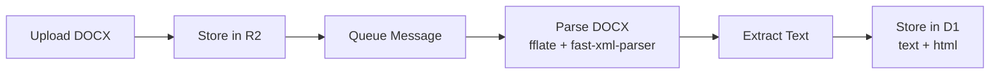
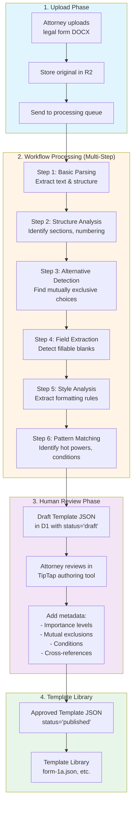

# Future Schema Extraction Architecture

## Context

This document analyzes how the current DOCX processing architecture (designed for basic text extraction) can evolve to support advanced schema extraction for the orange-book-parser project.

**orange-book-parser goal**: Convert legal Word documents into structured JSON templates with:
- Sections and alternatives (mutually exclusive choices)
- Form fields with validation rules
- Conditional logic
- Cross-references to legal notes
- Human-in-the-middle review and correction

## Current Architecture (Phase 1: Basic Extraction)



**Capabilities:**
- ✅ Unzip DOCX (ZIP archive)
- ✅ Parse word/document.xml
- ✅ Extract paragraph text
- ✅ Extract run-level text nodes
- ✅ Convert to plain text and HTML

## Future Architecture (Phase 2: Schema Extraction)

### High-Level Flow



## Architectural Compatibility Analysis

### ✅ **FULLY COMPATIBLE**

#### 1. **Cloudflare Workflows = Perfect Fit**

Current simple queue consumer can evolve to Workflow:

```typescript
// Current (Phase 1): Simple Queue Consumer
export default {
  async queue(batch, env) {
    for (const message of batch.messages) {
      const { text, html } = parseDocx(buffer)
      // Store text, done
    }
  }
}

// Future (Phase 2): Cloudflare Workflow
export default {
  async workflow(env, context) {
    // Step 1: Basic parsing
    const { text, structure } = await context.step('parse-basic', async () => {
      return parseDocxBasic(buffer)
    })

    // Step 2: Structure analysis
    const sections = await context.step('analyze-structure', async () => {
      return extractSections(structure)
    })

    // Step 3: Alternative detection
    const alternatives = await context.step('detect-alternatives', async () => {
      return findAlternatives(sections)
    })

    // Step 4: Field extraction
    const fields = await context.step('extract-fields', async () => {
      return findFields(sections)
    })

    // Step 5: Style analysis
    const styles = await context.step('analyze-styles', async () => {
      return extractStyles(buffer)
    })

    // Step 6: Generate draft schema
    const draftSchema = await context.step('generate-schema', async () => {
      return buildFormDefinition({
        sections,
        alternatives,
        fields,
        styles
      })
    })

    // Step 7: Store for human review
    await context.step('store-draft', async () => {
      await storeDraftTemplate(draftSchema, { status: 'needs_review' })
    })

    // Step 8: Pause and wait for attorney approval
    const approved = await context.sleep('wait-for-approval', Duration.days(30))

    // Step 9: Publish to template library
    if (approved) {
      await context.step('publish', async () => {
        await publishTemplate(draftSchema)
      })
    }

    return draftSchema
  }
}
```

**Workflow Benefits:**
- Up to **1024 steps** (plenty for complex parsing)
- **Durable state** - survives across steps
- **Human approval gates** - pause workflow, wait for attorney review
- **Retries & error handling** - built-in
- **Progress tracking** - attorney can see extraction progress

#### 2. **DOCX Parser Extension**

Current parser extracts basic text. Easy to extend:

**Current capabilities:**
```typescript
interface DocxContent {
  text: string           // Plain text
  html: string           // Basic HTML
  paragraphs: Array<{    // List of paragraphs
    text: string
    style?: string
  }>
}
```

**Extended capabilities (Phase 2):**
```typescript
interface DocxStructure {
  // Phase 1 (Current)
  text: string
  html: string

  // Phase 2 (Schema Extraction)
  sections: Section[]              // Hierarchical structure
  alternatives: Alternative[]      // Detected alternatives
  fields: Field[]                  // Fillable blanks
  styles: StyleDefinition[]        // Formatting rules
  numbering: NumberingScheme[]     // List numbering
  tables: Table[]                  // Tabular data

  // Metadata for review
  confidence: {                    // AI confidence scores
    sections: number               // How confident is structure detection?
    alternatives: number
    fields: number
  }
  requiresReview: string[]         // List of items needing human review
}
```

**Implementation approach:**
```typescript
// server/utils/docx-parser-extended.ts
import { unzipSync } from 'fflate'
import { XMLParser } from 'fast-xml-parser'

export function parseDocxExtended(buffer: ArrayBuffer): DocxStructure {
  const uint8Array = new Uint8Array(buffer)
  const unzipped = unzipSync(uint8Array)

  // Extract multiple XML files
  const documentXml = unzipped['word/document.xml']
  const stylesXml = unzipped['word/styles.xml']
  const numberingXml = unzipped['word/numbering.xml']

  const parser = new XMLParser({ ignoreAttributes: false })

  // Parse document structure
  const doc = parser.parse(new TextDecoder().decode(documentXml))
  const styles = parser.parse(new TextDecoder().decode(stylesXml))
  const numbering = parser.parse(new TextDecoder().decode(numberingXml))

  // Extract sections (look for w:p with outline levels)
  const sections = extractSections(doc)

  // Detect alternatives (look for "Alternative 1", "Alternative 2" patterns)
  const alternatives = detectAlternatives(sections)

  // Find fields (look for blank lines, underscores, etc.)
  const fields = extractFields(sections)

  // Extract styles
  const styleDefinitions = extractStyles(styles)

  // Extract numbering schemes
  const numberingSchemes = extractNumbering(numbering)

  return {
    text: extractPlainText(doc),
    html: convertToHtml(doc),
    sections,
    alternatives,
    fields,
    styles: styleDefinitions,
    numbering: numberingSchemes,
    confidence: calculateConfidence({ sections, alternatives, fields }),
    requiresReview: flagUncertainItems({ sections, alternatives, fields })
  }
}

// Detect alternatives by pattern matching
function detectAlternatives(sections: Section[]): Alternative[] {
  const alternatives = []

  for (const section of sections) {
    const text = section.content.map(p => p.text).join(' ')

    // Pattern: "Alternative 1:", "Alternative 2:", etc.
    const altMatch = text.match(/Alternative\s+(\d+):/gi)

    if (altMatch) {
      alternatives.push({
        id: `alt-${section.id}-${altMatch[1]}`,
        title: altMatch[0],
        sectionId: section.id,
        content: extractAlternativeContent(section),
        mutuallyExclusiveWith: findMutualExclusions(section, altMatch[1]),
        confidence: 0.85  // Flagged for human review
      })
    }
  }

  return alternatives
}

// Detect fields by looking for blank patterns
function extractFields(sections: Section[]): Field[] {
  const fields = []

  for (const section of sections) {
    for (const para of section.content) {
      // Pattern: "Name: __________"
      const blankMatch = para.text.match(/([A-Za-z\s]+):\s*_{5,}/g)

      if (blankMatch) {
        fields.push({
          id: `field-${section.id}-${generateId()}`,
          label: blankMatch[1].trim(),
          type: inferFieldType(blankMatch[1]),
          sectionId: section.id,
          required: true,  // Assume required, attorney can change
          confidence: 0.7
        })
      }

      // Pattern: "[Date]", "[Name]", etc.
      const bracketMatch = para.text.match(/\[([A-Za-z\s]+)\]/g)
      if (bracketMatch) {
        // Similar field extraction
      }
    }
  }

  return fields
}

// Infer field type from label
function inferFieldType(label: string): FieldType {
  const lower = label.toLowerCase()

  if (lower.includes('date')) return 'date'
  if (lower.includes('address')) return 'address'
  if (lower.includes('city')) return 'city'
  if (lower.includes('state')) return 'state'
  if (lower.includes('zip')) return 'zip'
  if (lower.includes('phone')) return 'phone'
  if (lower.includes('email')) return 'email'
  if (lower.includes('name')) return 'name'

  return 'text'  // Default
}
```

#### 3. **Database Schema Evolution**

Current schema stores basic content:

```sql
-- Phase 1 (Current)
CREATE TABLE documents (
  id TEXT PRIMARY KEY,
  user_id TEXT NOT NULL,
  filename TEXT NOT NULL,
  blob_path TEXT NOT NULL,
  status TEXT NOT NULL,  -- 'processing', 'completed', 'failed'
  content_text TEXT,
  content_html TEXT,
  created_at INTEGER NOT NULL,
  processed_at INTEGER
);
```

**Phase 2 adds template schema storage:**

```sql
-- Phase 2: Add template extraction
CREATE TABLE document_templates (
  id TEXT PRIMARY KEY,
  document_id TEXT NOT NULL,  -- References documents table

  -- Extracted structure
  sections_json TEXT NOT NULL,      -- Array of Section objects
  alternatives_json TEXT NOT NULL,  -- Array of Alternative objects
  fields_json TEXT NOT NULL,        -- Array of Field objects
  styles_json TEXT NOT NULL,        -- StyleDefinitions

  -- Review workflow
  status TEXT NOT NULL,  -- 'draft', 'needs_review', 'approved', 'published'
  confidence_score REAL, -- Overall confidence (0-1)
  requires_review TEXT,  -- JSON array of items needing review

  -- Attorney annotations
  attorney_notes TEXT,
  corrections_made TEXT,  -- JSON log of human corrections

  -- Publishing
  form_id TEXT,          -- e.g., "form-1a" once published
  version TEXT,          -- e.g., "2015"
  category TEXT,

  created_at INTEGER NOT NULL,
  reviewed_at INTEGER,
  published_at INTEGER,

  FOREIGN KEY (document_id) REFERENCES documents(id)
);

-- Index for finding templates needing review
CREATE INDEX idx_templates_status ON document_templates(status);
CREATE INDEX idx_templates_form ON document_templates(form_id, version);
```

#### 4. **Human-in-the-Middle Workflow**

Cloudflare Workflows support human approval perfectly:

```typescript
// Workflow with human approval gate
export default {
  async workflow(env, context) {
    // Automated extraction (Steps 1-6)
    const draftSchema = await extractSchema(context)

    // Store draft
    await context.step('store-draft', async () => {
      await db.prepare(`
        INSERT INTO document_templates
        (id, document_id, sections_json, alternatives_json, fields_json, status)
        VALUES (?, ?, ?, ?, ?, 'needs_review')
      `).bind(
        nanoid(),
        documentId,
        JSON.stringify(draftSchema.sections),
        JSON.stringify(draftSchema.alternatives),
        JSON.stringify(draftSchema.fields),
        'needs_review'
      ).run()
    })

    // Notify attorney
    await context.step('notify-attorney', async () => {
      // Send email or in-app notification
      await sendNotification(userId, {
        type: 'template_ready_for_review',
        templateId: draftSchema.id
      })
    })

    // WAIT FOR HUMAN APPROVAL (workflow pauses here)
    const approval = await context.waitForEvent('attorney_approval', {
      timeout: Duration.days(30)
    })

    if (approval.approved) {
      // Apply human corrections
      await context.step('apply-corrections', async () => {
        await applyCorrections(draftSchema.id, approval.corrections)
      })

      // Publish to template library
      await context.step('publish', async () => {
        await db.prepare(`
          UPDATE document_templates
          SET status = 'published', published_at = CURRENT_TIMESTAMP
          WHERE id = ?
        `).bind(draftSchema.id).run()
      })
    }

    return { status: approval.approved ? 'published' : 'rejected' }
  }
}
```

**Attorney review UI flow:**
1. Navigate to `/templates/review/{templateId}`
2. See TipTap editor with extracted structure
3. Review auto-detected sections, alternatives, fields
4. Correct mistakes, add metadata
5. Click "Approve & Publish"
6. Workflow resumes and publishes template

#### 5. **Integration with TipTap Authoring Tool**

The extracted draft can load directly into the TipTap editor:

```typescript
// pages/templates/review/[id].vue
<script setup>
import { useEditor } from '@tiptap/vue-3'
import { Alternative, HotPowerField, FormField } from '~/tiptap/nodes'

const route = useRoute()
const templateId = route.params.id

// Load draft template
const { data: template } = await useFetch(`/api/templates/${templateId}`)

// Initialize TipTap with extracted content
const editor = useEditor({
  content: buildEditorContent(template.value),
  extensions: [
    Document,
    Paragraph,
    Text,
    Alternative,      // Custom node for alternatives
    HotPowerField,    // Custom node for hot powers
    FormField,        // Custom node for fields
    // ... other extensions
  ]
})

// Convert extracted JSON → TipTap document
function buildEditorContent(template) {
  return {
    type: 'doc',
    content: template.sections.map(section => ({
      type: 'section',
      attrs: { id: section.id },
      content: [
        {
          type: 'heading',
          content: [{ type: 'text', text: section.title }]
        },
        ...section.content.map(para => ({
          type: 'paragraph',
          content: [{ type: 'text', text: para.text }]
        })),
        // Insert alternatives as custom nodes
        ...template.alternatives
          .filter(alt => alt.sectionId === section.id)
          .map(alt => ({
            type: 'alternative',
            attrs: {
              id: alt.id,
              title: alt.title,
              mutuallyExclusiveWith: alt.mutuallyExclusiveWith
            },
            content: alt.content
          }))
      ]
    }))
  }
}

// Save corrections back to workflow
async function approveTemplate() {
  const corrections = editor.getJSON()

  await $fetch(`/api/templates/${templateId}/approve`, {
    method: 'POST',
    body: { corrections }
  })

  // Resume workflow (sends event to waiting workflow)
  await $fetch(`/api/workflows/${template.workflowId}/event`, {
    method: 'POST',
    body: {
      eventType: 'attorney_approval',
      data: { approved: true, corrections }
    }
  })
}
</script>
```

## Migration Path

### Phase 1: Basic Text Extraction (Current POC)
- ✅ Upload DOCX → R2
- ✅ Queue → Parse → Extract text
- ✅ Store in D1
- **Timeline: 1-2 weeks**

### Phase 2A: Enhanced Parsing (Next)
- Extend parser to extract structure
- Add section detection
- Add style extraction
- Store structured data
- **Timeline: 2-3 weeks**

### Phase 2B: Pattern Matching (After 2A)
- Alternative detection
- Field extraction
- Hot power identification
- Confidence scoring
- **Timeline: 2-3 weeks**

### Phase 3: Workflow Integration
- Convert queue consumer → Workflow
- Add multi-step processing
- Add human approval gate
- Build review UI
- **Timeline: 3-4 weeks**

### Phase 4: TipTap Integration
- Load extracted structure into editor
- Custom nodes for legal concepts
- Correction workflow
- Template publishing
- **Timeline: 4-6 weeks**

## Key Architectural Decisions

### ✅ **RECOMMENDATION: Proceed with Cloudflare Architecture**

**Why this architecture supports future schema extraction:**

1. **Incremental Enhancement**
   - Start simple (text extraction)
   - Add complexity gradually
   - No architectural rework needed

2. **Cloudflare Workflows = Perfect Fit**
   - Multi-step processing
   - Human-in-the-middle
   - Durable state
   - Up to 1024 steps

3. **Unified Platform**
   - Same D1 database for everything
   - Same R2 storage
   - Same Workers runtime
   - No external services

4. **Cost Efficiency**
   - Workflows included in Workers plan
   - No need for separate services
   - Pay-per-use model

5. **Developer Experience**
   - Single codebase
   - TypeScript everywhere
   - NuxtHub abstractions
   - Easy testing/debugging

### What Changes from Current Design?

**Minimal changes needed:**

1. **Parser utility** - Extend to extract more structure (same file, more functions)
2. **Database schema** - Add `document_templates` table (additive, no breaking changes)
3. **Queue consumer** - Upgrade to Workflow (compatible API)
4. **Add review UI** - New pages, doesn't affect existing features

**No breaking changes:**
- Basic DOCX upload/viewing still works
- Existing documents unaffected
- Can run both workflows in parallel

## Conclusion

✅ **The proposed Cloudflare-native DOCX processing architecture is FULLY COMPATIBLE with future schema extraction needs.**

Key factors:
1. **Cloudflare Workflows** are purpose-built for complex, multi-step pipelines with human approval
2. **fflate + fast-xml-parser** can extract all OOXML structure (not just text)
3. **Incremental enhancement** - start simple, add complexity without rework
4. **Human-in-the-middle** naturally supported by workflow pause/resume
5. **TipTap integration** straightforward - load extracted JSON into editor

**No architectural corner-painting.** This design grows naturally from basic text extraction to full schema extraction without fundamental changes.

## Next Steps

1. ✅ **Implement Phase 1** (basic text extraction) as designed
2. ✅ **Test with legal documents** from orange-book-parser
3. **Prototype structure extraction** on one sample form
4. **Validate workflow integration** with human approval
5. **Build attorney review UI** in TipTap

The architecture is sound for both current POC needs and future sophisticated schema extraction.
