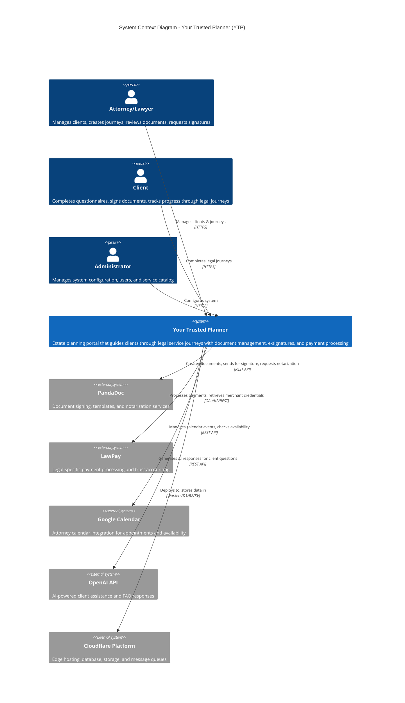
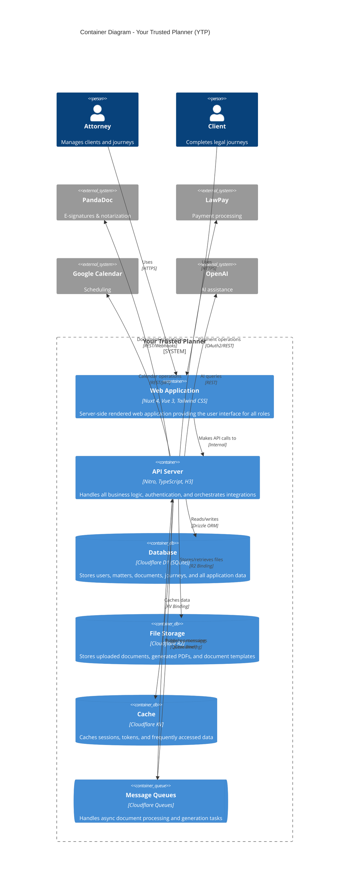
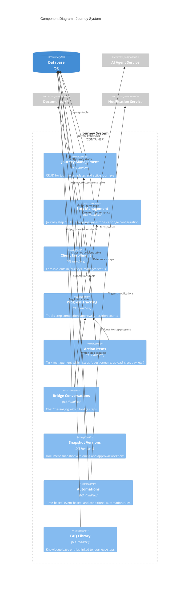
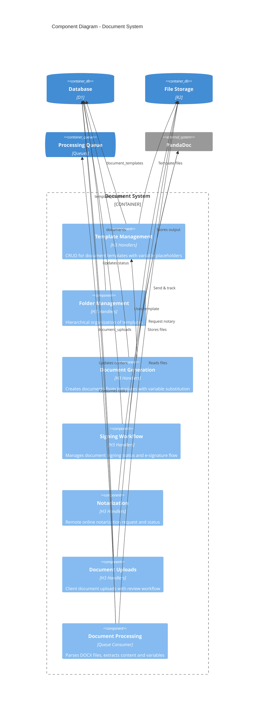
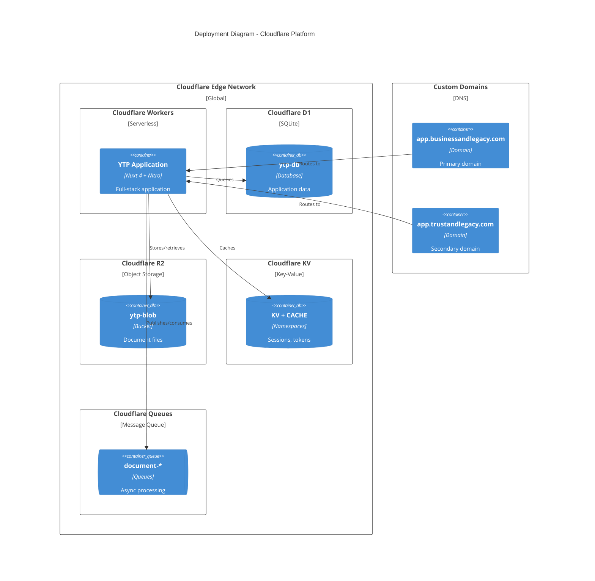

# C4 Architecture Diagrams

This document provides architectural views of the Your Trusted Planner (YTP) system at three levels of abstraction using the C4 model.

## Table of Contents
1. [Level 1: System Context](#level-1-system-context)
2. [Level 2: Container Diagram](#level-2-container-diagram)
3. [Level 3: Component Diagrams](#level-3-component-diagrams)

---

## Level 1: System Context

The Context diagram shows the YTP system in scope, its users, and relationships with external systems.

### Context Narrative

**Your Trusted Planner (YTP)** is an estate planning portal designed to streamline the client journey from initial consultation through document signing and ongoing maintenance.

**Primary Users:**
- **Attorneys/Lawyers** use the system to manage their client relationships, create and customize legal service journeys, review uploaded documents, and request signatures on legal documents.
- **Clients** interact with the system to complete questionnaires, upload required documents, track their progress through legal processes, sign documents electronically, and communicate with their attorney.
- **Administrators** configure the system, manage users, maintain the service catalog, and oversee system operations.

**External Dependencies:**
- **PandaDoc** provides document template management, electronic signature collection, and remote online notarization (RON) services.
- **LawPay** handles payment processing with legal-industry-specific features like trust accounting compliance.
- **Google Calendar** enables attorneys to manage appointments and allows the system to check availability for scheduling.
- **OpenAI API** powers the AI assistant that helps clients with common questions during their journey.
- **Cloudflare Platform** provides the infrastructure including edge computing (Workers), database (D1), object storage (R2), and caching (KV).

---

## Level 2: Container Diagram

The Container diagram zooms into the YTP system to show the high-level technical building blocks.

### Container Descriptions

| Container | Technology | Purpose |
|-----------|------------|---------|
| **Web Application** | Nuxt 4, Vue 3, Tailwind CSS | Server-side rendered frontend providing role-based dashboards for attorneys, clients, and administrators. Includes pages for journey management, document handling, appointments, and client communication. |
| **API Server** | Nitro, TypeScript, H3 | Backend server handling authentication (session-based with JWT), authorization (role-based), business logic, and integration orchestration. Deployed as Cloudflare Workers. |
| **Database** | Cloudflare D1 (SQLite) | Relational database storing all application data including users, client profiles, matters, services, documents, journeys, progress tracking, and audit logs. Accessed via Drizzle ORM. |
| **File Storage** | Cloudflare R2 | Object storage for uploaded documents (DOCX, PDF), generated documents, document templates, and client uploads. Provides S3-compatible API. |
| **Cache** | Cloudflare KV | Key-value store for session data, OAuth tokens (LawPay), and frequently accessed configuration. Provides fast edge-located reads. |
| **Message Queues** | Cloudflare Queues | Asynchronous processing for document template parsing, document generation, and other background tasks. Supports batch processing with configurable concurrency. |

### Data Flow

1. Users access the **Web Application** via HTTPS
2. The **Web Application** makes internal calls to the **API Server**
3. The **API Server** persists data to the **Database** via Drizzle ORM
4. File uploads go to **File Storage** (R2)
5. Sessions and tokens are cached in **Cache** (KV)
6. Long-running tasks are queued to **Message Queues**
7. Queue consumers process tasks and update the **Database**
8. External integrations are called as needed (PandaDoc, LawPay, etc.)

---

## Level 3: Component Diagrams

### 3.1 API Server Components

```mermaid
C4Component
    title Component Diagram - API Server

    Container_Boundary(api, "API Server") {
        Component(auth, "Authentication Module", "TypeScript", "Handles login, logout, registration, session management, and password hashing")
        Component(authz, "Authorization Middleware", "TypeScript", "Role-based access control (ADMIN, LAWYER, CLIENT, LEAD, PROSPECT)")

        Component(clients, "Clients API", "H3 Handlers", "Client management, profiles, notes, and document listing")
        Component(matters, "Matters API", "H3 Handlers", "Case/matter management and service linking")
        Component(documents, "Documents API", "H3 Handlers", "Document upload, generation, signing, and status tracking")
        Component(journeys, "Journeys API", "H3 Handlers", "Journey templates, steps, client enrollment, and progress tracking")
        Component(appointments, "Appointments API", "H3 Handlers", "Scheduling, calendar sync, and availability")
        Component(catalog, "Service Catalog API", "H3 Handlers", "Product/service definitions and pricing")
        Component(dashboard, "Dashboard API", "H3 Handlers", "Statistics, activity feeds, and reporting")

        Component(pandadocSvc, "PandaDoc Service", "TypeScript", "Document creation, sending, signing, notarization")
        Component(lawpaySvc, "LawPay Service", "TypeScript", "OAuth flow, token management, payment processing")
        Component(calendarSvc, "Calendar Service", "TypeScript", "Google Calendar integration via service account")
        Component(aiSvc, "AI Agent Service", "TypeScript", "OpenAI integration for client Q&A")
        Component(docProcessor, "Document Processor", "TypeScript", "DOCX parsing and content extraction")

        Component(queueConsumer, "Queue Consumer", "TypeScript", "Processes async document tasks from queue")
    }

    ContainerDb(database, "Database", "D1")
    ContainerDb(storage, "File Storage", "R2")
    ContainerDb(cache, "Cache", "KV")
    ContainerQueue(queue, "Message Queue", "Queues")

    System_Ext(pandadoc, "PandaDoc API", "")
    System_Ext(lawpay, "LawPay API", "")
    System_Ext(google, "Google Calendar API", "")
    System_Ext(openai, "OpenAI API", "")

    Rel(auth, database, "Validates credentials")
    Rel(auth, cache, "Stores sessions")
    Rel(authz, auth, "Checks session")

    Rel(clients, database, "CRUD operations")
    Rel(matters, database, "CRUD operations")
    Rel(documents, database, "CRUD operations")
    Rel(documents, storage, "File operations")
    Rel(documents, queue, "Queues processing")
    Rel(journeys, database, "CRUD operations")
    Rel(appointments, database, "CRUD operations")
    Rel(catalog, database, "CRUD operations")
    Rel(dashboard, database, "Aggregates data")

    Rel(documents, pandadocSvc, "Uses")
    Rel(pandadocSvc, pandadoc, "REST calls")

    Rel(lawpaySvc, lawpay, "OAuth/REST")
    Rel(lawpaySvc, cache, "Token storage")

    Rel(appointments, calendarSvc, "Uses")
    Rel(calendarSvc, google, "REST calls")

    Rel(journeys, aiSvc, "Uses")
    Rel(aiSvc, openai, "REST calls")

    Rel(queueConsumer, queue, "Consumes")
    Rel(queueConsumer, docProcessor, "Uses")
    Rel(queueConsumer, database, "Updates")
    Rel(docProcessor, storage, "Reads files")

    UpdateLayoutConfig($c4ShapeInRow="4", $c4BoundaryInRow="1")
```

### 3.2 Component Responsibilities

#### Core API Modules

| Component | Endpoints | Responsibility |
|-----------|-----------|----------------|
| **Authentication Module** | `/api/auth/*` | User login/logout, registration, session management, password hashing (bcryptjs), JWT token handling |
| **Authorization Middleware** | (applied to all) | `requireAuth()` and `requireRole()` middleware for protecting endpoints |
| **Clients API** | `/api/clients/*` | Client CRUD, profile management, notes, document listing per client |
| **Matters API** | `/api/matters/*` | Case/matter management, linking services to matters |
| **Documents API** | `/api/documents/*` | Document upload, template generation, signing workflow, status tracking |
| **Journeys API** | `/api/journeys/*`, `/api/journey-steps/*`, `/api/client-journeys/*` | Journey template management, step ordering, client enrollment, progress tracking |
| **Appointments API** | `/api/appointments/*` | Appointment CRUD, calendar synchronization |
| **Service Catalog API** | `/api/catalog/*` | Service/product definitions, pricing, engagement letters |
| **Dashboard API** | `/api/dashboard/*` | Statistics aggregation, activity feeds |

#### Integration Services

| Service | External System | Capabilities |
|---------|-----------------|--------------|
| **PandaDoc Service** | PandaDoc API | Create documents from templates, send for signature, request notarization, check status, download signed PDFs, handle webhooks |
| **LawPay Service** | LawPay API | OAuth2 authorization flow, token exchange and refresh, gateway credential retrieval, merchant deauthorization |
| **Calendar Service** | Google Calendar API | Service account JWT authentication, event CRUD, free/busy queries, domain-wide delegation support |
| **AI Agent Service** | OpenAI API | Context-aware question answering, FAQ integration, journey-specific responses |
| **Document Processor** | Internal | DOCX parsing, text/HTML extraction, variable detection in templates |

#### Background Processing

| Component | Queue | Function |
|-----------|-------|----------|
| **Queue Consumer** | `document-template-processing` | Parses uploaded DOCX templates, extracts content, updates database |
| **Queue Consumer** | `document-generation` | Generates documents from templates with variable substitution |

---

### 3.3 Journey System Components

The Journey system is complex enough to warrant its own component view.

### Journey System Narrative

The **Journey System** is the core workflow engine that guides clients through legal service processes.

**Key Concepts:**

1. **Journeys** are workflow templates (e.g., "Trust Formation Journey") that can be instantiated for each client
2. **Steps** are either:
   - **Milestones** - Significant checkpoints (e.g., "Documents Signed")
   - **Bridges** - Interactive phases requiring back-and-forth (e.g., "Snapshot Review & Revision")
3. **Client Journeys** track a specific client's progress through a journey
4. **Step Progress** tracks completion status, approvals, and iteration counts for each step
5. **Action Items** are specific tasks within steps:
   - `QUESTIONNAIRE` - Fill out a form
   - `UPLOAD` - Upload a document
   - `ESIGN` - Sign electronically
   - `NOTARY` - Complete notarization
   - `PAYMENT` - Make a payment
   - `REVIEW` - Attorney review
   - `DECISION` - Make a choice
   - `MEETING` - Schedule appointment
   - `KYC` - Identity verification
6. **Bridge Conversations** enable chat between client and attorney (or AI) during bridge steps
7. **Snapshot Versions** track revisions of key documents with approval workflow
8. **Automations** trigger actions based on time, events, or conditions

---

### 3.4 Document System Components

### Document Workflow

1. **Template Creation**: Attorneys upload DOCX templates with variable placeholders
2. **Processing**: Queue consumer parses templates, extracts variables
3. **Generation**: System creates document instances with client-specific values
4. **Signing**: Documents sent to PandaDoc for e-signature
5. **Notarization**: Optional remote online notarization via PandaDoc
6. **Storage**: All files stored in R2, metadata in D1

**Document Statuses:**
- `DRAFT` - Being prepared
- `SENT` - Sent to client for action
- `VIEWED` - Client has viewed
- `SIGNED` - Client has signed
- `COMPLETED` - All actions complete

**Notarization Statuses:**
- `NOT_REQUIRED` - No notarization needed
- `PENDING` - Awaiting scheduling
- `SCHEDULED` - Notary session scheduled
- `COMPLETED` - Notarization complete

---

## Deployment Architecture

### Environment Configuration

| Variable | Purpose |
|----------|---------|
| `JWT_SECRET` | Session token signing |
| `PANDADOC_API_KEY` | PandaDoc authentication |
| `PANDADOC_SANDBOX` | Enable sandbox mode |
| `LAWPAY_CLIENT_ID` | LawPay OAuth client |
| `LAWPAY_CLIENT_SECRET` | LawPay OAuth secret |
| `LAWPAY_REDIRECT_URI` | OAuth callback URL |
| `GOOGLE_SERVICE_ACCOUNT_EMAIL` | Calendar service account |
| `GOOGLE_SERVICE_ACCOUNT_PRIVATE_KEY` | Calendar auth key |
| `OPENAI_API_KEY` | AI assistant API key |
| `NUXT_SEED_TOKEN` | Database seeding auth |

---

## Summary

This C4 documentation provides three levels of architectural detail:

1. **Context** - Shows YTP's place in the ecosystem with users and external systems
2. **Container** - Details the technical components: web app, API, database, storage, cache, and queues
3. **Component** - Dives into the API server's internal structure, with focused views on the Journey and Document systems

The architecture follows modern serverless patterns on Cloudflare's edge platform, with clear separation between:
- User interface (Nuxt/Vue SSR)
- Business logic (Nitro API handlers)
- Data persistence (D1 SQLite)
- File storage (R2)
- Caching (KV)
- Async processing (Queues)
- External integrations (PandaDoc, LawPay, Google, OpenAI)
