# Entity Relationship Diagram

## Database Schema Overview

This document describes the entity relationships in the YTP database schema.

```mermaid
erDiagram
    %% ===================================
    %% CORE USER & CLIENT MANAGEMENT
    %% ===================================

    users {
        text id PK
        text email UK
        text password
        text role "ADMIN|LAWYER|CLIENT|LEAD|PROSPECT"
        text firstName
        text lastName
        text phone
        text avatar
        text status "PROSPECT|PENDING_APPROVAL|ACTIVE|INACTIVE"
        timestamp createdAt
        timestamp updatedAt
    }

    clientProfiles {
        text id PK
        text userId FK,UK
        timestamp dateOfBirth
        text address
        text city
        text state
        text zipCode
        text spouseName
        text spouseEmail
        text spousePhone
        boolean hasMinorChildren
        text childrenInfo "JSON"
        text businessName
        text businessType
        boolean hasWill
        boolean hasTrust
        timestamp lastUpdated
        text assignedLawyerId FK
        timestamp createdAt
        timestamp updatedAt
    }

    users ||--o| clientProfiles : "has profile"
    users ||--o{ clientProfiles : "assigned as lawyer"

    %% ===================================
    %% APPOINTMENTS
    %% ===================================

    appointments {
        text id PK
        text title
        text description
        timestamp startTime
        timestamp endTime
        text status "PENDING|CONFIRMED|COMPLETED|CANCELLED"
        text location
        text notes
        text clientId FK
        timestamp createdAt
        timestamp updatedAt
    }

    users ||--o{ appointments : "has appointments"

    %% ===================================
    %% DOCUMENT TEMPLATES & FOLDERS
    %% ===================================

    templateFolders {
        text id PK
        text name
        text description
        text parentId FK "self-reference"
        integer order
        timestamp createdAt
        timestamp updatedAt
    }

    templateFolders ||--o{ templateFolders : "contains subfolders"

    documentTemplates {
        text id PK
        text name
        text description
        text category
        text folderId FK
        text content
        text variables "JSON"
        boolean requiresNotary
        boolean isActive
        integer order
        text originalFileName
        text fileExtension
        timestamp createdAt
        timestamp updatedAt
    }

    templateFolders ||--o{ documentTemplates : "contains templates"

    %% ===================================
    %% MATTERS & SERVICES
    %% ===================================

    serviceCatalog {
        text id PK
        text name
        text description
        text category
        text type "SINGLE|RECURRING"
        integer price "cents"
        text duration "MONTHLY|ANNUALLY|QUARTERLY"
        text engagementLetterId FK
        text workflowSteps "JSON"
        boolean isActive
        timestamp createdAt
        timestamp updatedAt
    }

    documentTemplates ||--o{ serviceCatalog : "engagement letter"

    matters {
        text id PK
        text clientId FK
        text title
        text matterNumber "Auto-generated YYYY-NNN"
        text description
        text status "OPEN|CLOSED|PENDING"
        timestamp contractDate "Engagement letter signing date"
        timestamp createdAt
        timestamp updatedAt
    }

    users ||--o{ matters : "has matters"

    mattersToServices {
        text matterId FK,PK
        text catalogId FK,PK
        timestamp engagedAt
        text assignedAttorneyId FK
        text status "PENDING|ACTIVE|COMPLETED|CANCELLED"
        timestamp startDate
        timestamp endDate
    }

    matters ||--o{ mattersToServices : "engages services"
    serviceCatalog ||--o{ mattersToServices : "engaged in matters"
    users ||--o{ mattersToServices : "assigned attorney"

    payments {
        text id PK
        text matterId FK
        text paymentType "CONSULTATION|DEPOSIT_50|FINAL_50|MAINTENANCE|CUSTOM"
        integer amount "cents"
        text paymentMethod "LAWPAY|CHECK|WIRE|CREDIT_CARD|ACH|OTHER"
        text lawpayTransactionId
        text status "PENDING|PROCESSING|COMPLETED|FAILED|REFUNDED"
        timestamp paidAt
        text notes
        timestamp createdAt
        timestamp updatedAt
    }

    matters ||--o{ payments : "has payments"

    %% ===================================
    %% DOCUMENTS
    %% ===================================

    documents {
        text id PK
        text title
        text description
        text status "DRAFT|SENT|VIEWED|SIGNED|COMPLETED"
        text templateId FK
        text matterId FK
        text catalogId FK
        text content
        text filePath
        integer fileSize
        text mimeType
        text variableValues "JSON"
        boolean requiresNotary
        text notarizationStatus "NOT_REQUIRED|PENDING|SCHEDULED|COMPLETED"
        text pandaDocRequestId
        text clientId FK
        timestamp signedAt
        text signatureData
        timestamp viewedAt
        timestamp sentAt
        timestamp createdAt
        timestamp updatedAt
    }

    documentTemplates ||--o{ documents : "generated from"
    mattersToServices ||--o{ documents : "related to engagement"
    matters ||--o{ documents : "related to matter"
    users ||--o{ documents : "belongs to client"
    serviceCatalog ||--o{ documents : "engagement letter template"

    %% ===================================
    %% NOTES & ACTIVITIES
    %% ===================================

    notes {
        text id PK
        text content
        text clientId FK
        timestamp createdAt
        timestamp updatedAt
    }

    users ||--o{ notes : "has notes"

    activities {
        text id PK
        text type
        text description
        text metadata "JSON"
        text userId FK
        timestamp createdAt
    }

    users ||--o{ activities : "performs activities"

    %% ===================================
    %% SETTINGS
    %% ===================================

    settings {
        text id PK
        text key UK
        text value
        text description
        timestamp createdAt
        timestamp updatedAt
    }

    %% ===================================
    %% QUESTIONNAIRES
    %% ===================================

    questionnaires {
        text id PK
        text name
        text description
        text serviceCatalogId FK
        text questions "JSON"
        boolean isActive
        timestamp createdAt
        timestamp updatedAt
    }

    serviceCatalog ||--o{ questionnaires : "has questionnaires"

    questionnaireResponses {
        text id PK
        text questionnaireId FK
        text appointmentId FK
        text userId FK
        text responses "JSON"
        timestamp submittedAt
    }

    questionnaires ||--o{ questionnaireResponses : "has responses"
    appointments ||--o{ questionnaireResponses : "linked to"
    users ||--o{ questionnaireResponses : "submitted by"

    %% ===================================
    %% JOURNEY SYSTEM
    %% ===================================

    journeys {
        text id PK
        text serviceCatalogId FK
        text name
        text description
        boolean isTemplate
        boolean isActive
        integer estimatedDurationDays
        timestamp createdAt
        timestamp updatedAt
    }

    serviceCatalog ||--o{ journeys : "has journeys"

    journeySteps {
        text id PK
        text journeyId FK
        text stepType "MILESTONE|BRIDGE"
        text name
        text description
        integer stepOrder
        text responsibleParty "CLIENT|COUNSEL|STAFF|BOTH"
        integer expectedDurationDays
        text automationConfig "JSON"
        text helpContent
        boolean allowMultipleIterations
        timestamp createdAt
        timestamp updatedAt
    }

    journeys ||--o{ journeySteps : "contains steps"

    clientJourneys {
        text id PK
        text clientId FK
        text matterId FK
        text catalogId FK
        text journeyId FK
        text currentStepId FK
        text status "NOT_STARTED|IN_PROGRESS|COMPLETED|PAUSED|CANCELLED"
        text priority "LOW|MEDIUM|HIGH|URGENT"
        timestamp startedAt
        timestamp completedAt
        timestamp pausedAt
        timestamp createdAt
        timestamp updatedAt
    }

    users ||--o{ clientJourneys : "enrolled in"
    journeys ||--o{ clientJourneys : "instances of"
    journeySteps ||--o{ clientJourneys : "current step"
    mattersToServices ||--o{ clientJourneys : "tracks progress for"

    journeyStepProgress {
        text id PK
        text clientJourneyId FK
        text stepId FK
        text status "PENDING|IN_PROGRESS|WAITING_CLIENT|WAITING_COUNSEL|COMPLETE|SKIPPED"
        boolean clientApproved
        boolean counselApproved
        timestamp clientApprovedAt
        timestamp counselApprovedAt
        integer iterationCount
        text notes
        timestamp startedAt
        timestamp completedAt
        timestamp createdAt
        timestamp updatedAt
    }

    clientJourneys ||--o{ journeyStepProgress : "tracks progress"
    journeySteps ||--o{ journeyStepProgress : "progress for"

    actionItems {
        text id PK
        text stepId FK
        text clientJourneyId FK
        text actionType "QUESTIONNAIRE|DECISION|UPLOAD|REVIEW|ESIGN|NOTARY|PAYMENT|MEETING|KYC"
        text title
        text description
        text config "JSON"
        text status "PENDING|IN_PROGRESS|COMPLETE|SKIPPED"
        text assignedTo "CLIENT|COUNSEL|STAFF"
        timestamp dueDate
        text priority "LOW|MEDIUM|HIGH|URGENT"
        timestamp completedAt
        text completedBy FK
        timestamp createdAt
        timestamp updatedAt
    }

    journeySteps ||--o{ actionItems : "template actions"
    clientJourneys ||--o{ actionItems : "instance actions"
    users ||--o{ actionItems : "completed by"

    bridgeConversations {
        text id PK
        text stepProgressId FK
        text userId FK
        text message
        boolean isAiResponse
        text metadata "JSON"
        timestamp createdAt
    }

    journeyStepProgress ||--o{ bridgeConversations : "has messages"
    users ||--o{ bridgeConversations : "sent by"

    faqLibrary {
        text id PK
        text journeyId FK
        text stepId FK
        text category
        text question
        text answer
        text tags "JSON"
        integer viewCount
        integer helpfulCount
        integer unhelpfulCount
        boolean isActive
        timestamp createdAt
        timestamp updatedAt
    }

    journeys ||--o{ faqLibrary : "journey-specific"
    journeySteps ||--o{ faqLibrary : "step-specific"

    documentUploads {
        text id PK
        text clientJourneyId FK
        text actionItemId FK
        text uploadedByUserId FK
        text documentCategory
        text fileName
        text originalFileName
        text filePath
        integer fileSize
        text mimeType
        text status "PENDING_REVIEW|REVIEWED|APPROVED|REJECTED|REQUIRES_REVISION"
        text reviewedByUserId FK
        timestamp reviewedAt
        text reviewNotes
        integer version
        text replacesUploadId FK "self-reference"
        timestamp createdAt
        timestamp updatedAt
    }

    clientJourneys ||--o{ documentUploads : "has uploads"
    actionItems ||--o{ documentUploads : "fulfills"
    users ||--o{ documentUploads : "uploaded by"
    users ||--o{ documentUploads : "reviewed by"
    documentUploads ||--o{ documentUploads : "replaces"

    snapshotVersions {
        text id PK
        text clientJourneyId FK
        integer versionNumber
        text content "JSON"
        text generatedPdfPath
        text status "DRAFT|SENT|UNDER_REVISION|APPROVED"
        timestamp sentAt
        timestamp approvedAt
        boolean approvedByClient
        boolean approvedByCounsel
        text clientFeedback "JSON"
        text counselNotes
        timestamp createdAt
        timestamp updatedAt
    }

    clientJourneys ||--o{ snapshotVersions : "has snapshots"

    automations {
        text id PK
        text journeyId FK
        text stepId FK
        text name
        text description
        text triggerType "TIME_BASED|EVENT_BASED|CONDITIONAL|MANUAL"
        text triggerConfig "JSON"
        text actionConfig "JSON"
        boolean isActive
        timestamp lastExecutedAt
        integer executionCount
        timestamp createdAt
        timestamp updatedAt
    }

    journeys ||--o{ automations : "has automations"
    journeySteps ||--o{ automations : "step-specific"

    %% ===================================
    %% MARKETING
    %% ===================================

    marketingSources {
        text id PK
        text name
        text utmSource
        text utmMedium
        text utmCampaign
        integer acquisitionCost "cents"
        boolean isActive
        timestamp createdAt
        timestamp updatedAt
    }

    clientMarketingAttribution {
        text id PK
        text clientId FK,UK
        text marketingSourceId FK
        text utmSource
        text utmMedium
        text utmCampaign
        text utmContent
        text utmTerm
        text referrerUrl
        text landingPage
        text ipAddress
        text userAgent
        timestamp createdAt
    }

    users ||--o| clientMarketingAttribution : "attributed to"
    marketingSources ||--o{ clientMarketingAttribution : "source of"

    %% ===================================
    %% DOCUMENT PROCESSING
    %% ===================================

    uploadedDocuments {
        text id PK
        text userId FK
        text filename
        text blobPath
        text status "processing|completed|failed"
        text contentText
        text contentHtml
        integer paragraphCount
        text errorMessage
        integer retryCount
        integer fileSize
        text mimeType
        timestamp createdAt
        timestamp processedAt
        timestamp updatedAt
    }

    users ||--o{ uploadedDocuments : "uploads"

    %% ===================================
    %% PAYMENT INTEGRATIONS
    %% ===================================

    lawpayConnections {
        text id PK
        text userId FK
        text merchantPublicKey
        text merchantName
        text scope
        timestamp expiresAt
        timestamp revokedAt
        timestamp createdAt
        timestamp updatedAt
    }

    users ||--o{ lawpayConnections : "has connections"
```

## Entity Groups

### Core User Management
- **users** - Central user table for all roles (Admin, Lawyer, Client, Lead, Prospect)
- **clientProfiles** - Extended profile information for client users

### Appointments & Scheduling
- **appointments** - Scheduled meetings between lawyers and clients

### Document Management
- **templateFolders** - Hierarchical folder structure for organizing templates
- **documentTemplates** - Reusable document templates with variable placeholders
- **documents** - Generated documents from templates, linked to clients and services
- **uploadedDocuments** - DOCX files uploaded for processing

### Service Catalog & Matters
- **serviceCatalog** - Product/service definitions (Trust Formation, LLC, etc.)
- **matters** - Client engagements that group related services (auto-generated matter numbers: YYYY-NNN)
- **mattersToServices** - Junction table linking matters to engaged services with status tracking
- **payments** - Payment tracking at the matter level

### Questionnaires
- **questionnaires** - Pre-consultation questionnaire definitions
- **questionnaireResponses** - Client responses to questionnaires

### Journey System
- **journeys** - Workflow/journey definitions (templates or active)
- **journeySteps** - Individual steps in a journey (Milestones or Bridges)
- **clientJourneys** - Tracks client progress through journeys
- **journeyStepProgress** - Detailed progress tracking per step
- **actionItems** - Tasks to complete within journey steps
- **bridgeConversations** - Chat messages within bridge steps
- **faqLibrary** - Knowledge base for help content
- **documentUploads** - Client-uploaded documents for review
- **snapshotVersions** - Version tracking for snapshot documents
- **automations** - Automation rules for journeys

### Marketing
- **marketingSources** - Marketing campaign/source definitions
- **clientMarketingAttribution** - UTM tracking and source attribution per client

### Other
- **notes** - Internal notes about clients
- **activities** - Activity/audit log
- **settings** - Application configuration key-value store
- **lawpayConnections** - LawPay OAuth2 connection metadata

## Key Relationships

1. **Users** are the central entity - they can be lawyers, clients, admins, leads, or prospects
2. **Matters** represent client engagements with auto-generated matter numbers (YYYY-NNN format)
3. **MattersToServices** is a junction table creating many-to-many relationships between matters and service catalog items (e.g., "Smith Family Trust 2024" matter engages both WYDAPT and Annual Maintenance)
4. **Payments** are tracked at the matter level, not per-service, simplifying financial reporting
5. **ClientJourneys** track client progress through service workflows, referencing the engagement via composite foreign key (matterId, catalogId)
6. **Journeys** define workflows with **JourneySteps** that clients progress through
7. **Documents** can be generated from **DocumentTemplates** and linked to matters and specific service engagements
8. **ActionItems** define tasks that need completion, either at the template level (linked to steps) or instance level (linked to client journeys)
