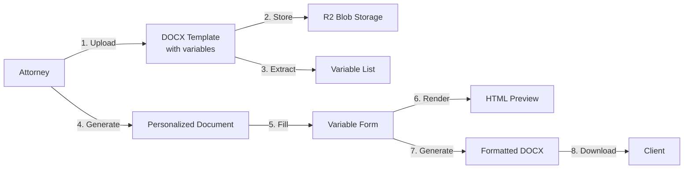
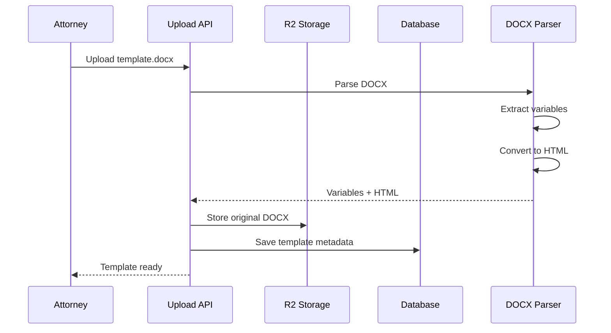
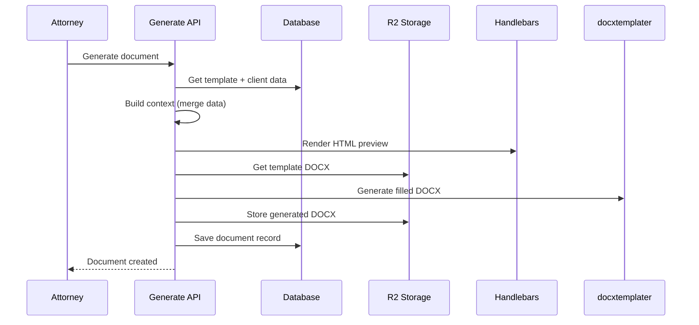

# Document Template System

The Document Template System enables attorneys to create reusable Word document templates with variable placeholders, generate personalized documents for clients, and deliver professional, formatted DOCX files.

## Overview



## Key Features

- ✅ **Simple Template Creation** - Use Word with `{{variableName}}` syntax
- ✅ **Automatic Variable Extraction** - System detects all template variables
- ✅ **Dual Rendering** - HTML preview + downloadable DOCX
- ✅ **Format Preservation** - All Word formatting maintained in output
- ✅ **Real-Time Updates** - Edit variables and regenerate instantly
- ✅ **Pre-filled Values** - Client data auto-populated

## Architecture

### Template Upload Flow



### Document Generation Flow



## Technologies

### Handlebars.js
**HTML rendering for browser preview**

- Custom `{{variable}}` syntax
- Helpers for date formatting, currency, etc.
- Fast rendering (~50-100ms)

### docxtemplater
**DOCX generation with formatting preservation**

- Configured with double-brace delimiters
- Maintains all Word styles, fonts, tables
- ~200-500ms per document

### NuxtHub Blob (R2)
**DOCX file storage**

- Original templates
- Generated documents
- Fast CDN delivery

## Data Model

### Template Storage

```typescript
interface DocumentTemplate {
  id: string
  name: string
  description: string
  category: string

  // Original DOCX in R2
  docxBlobKey: string

  // Parsed HTML for preview
  content: string

  // Extracted variables
  variables: string[]  // ["clientName", "fee", ...]

  requiresNotary: boolean
  createdAt: number
  updatedAt: number
}
```

### Generated Document

```typescript
interface Document {
  id: string
  title: string
  status: 'DRAFT' | 'SENT' | 'VIEWED' | 'SIGNED' | 'COMPLETED'

  templateId: string
  matterId: string
  clientId: string

  // Rendered HTML
  content: string

  // Generated DOCX in R2
  docxBlobKey: string

  // Filled variable values
  variableValues: Record<string, string>

  // Timestamps
  createdAt: number
  updatedAt: number
  sentAt?: number
  viewedAt?: number
  signedAt?: number
}
```

## Variable System

### Supported Syntax

::: v-pre
Only `{{variableName}}` is supported:

```
{{clientName}}
{{lead_attorney}}
{{fee}}
{{currentDate}}
```

❌ **NOT Supported**: Nested notation like `{{person.name}}`
:::

### Pre-filled Variables

When generating a document, the system auto-fills:

::: v-pre
| Variable | Source | Example |
|----------|--------|---------|
| `{{clientName}}` | Database | "John Doe" |
| `{{clientAddress}}` | Database | "123 Main St" |
| `{{currentDate}}` | Auto-generated | "January 5, 2026" |
| `{{fee}}` | Placeholder | "$[To be determined]" |
:::

### Custom Variables

Any variables in your template that aren't pre-filled appear in the form for manual entry.

## Performance

| Operation | Time | Notes |
|-----------|------|-------|
| Template upload | <1s | Parse + store |
| Document generation | <1s | HTML + DOCX |
| Variable updates | <1s | Re-render both formats |
| DOCX download | <500ms | Fetch from R2 |

## Workflow

### 1. Create Template (Attorney)

1. Design document in Word
2. Add `{{variables}}` where needed
3. Upload to system
4. Review extracted variables

### 2. Generate Document (Attorney)

1. Select template
2. Choose client
3. Optional: Link to matter
4. System auto-fills client data
5. Fill remaining variables
6. Preview in browser

### 3. Finalize & Deliver

1. Update any variables as needed
2. Change status to SENT
3. Download DOCX for client
4. Client signs (optional)
5. Mark as SIGNED/COMPLETED

## Security

- ✅ **Role-Based Access** - Only attorneys can upload templates
- ✅ **Authorization Checks** - Clients see only their documents
- ✅ **File Validation** - DOCX type and size limits
- ✅ **Secure Storage** - R2 with access control

## Future Enhancements

- **Template Versioning** - Track changes over time
- **Conditional Sections** - Show/hide based on data
- **Repeating Blocks** - Loop over lists (beneficiaries, etc.)
- **E-Signature Integration** - DocuSign, HelloSign
- **Bulk Generation** - Create multiple documents at once

## Learn More

- [User Guide](/help/attorney/documents) - How to use templates
- [API Reference](/architecture/api-audit) - Technical API docs
- [DOCX Processing](/architecture/docx-processing) - Low-level details
