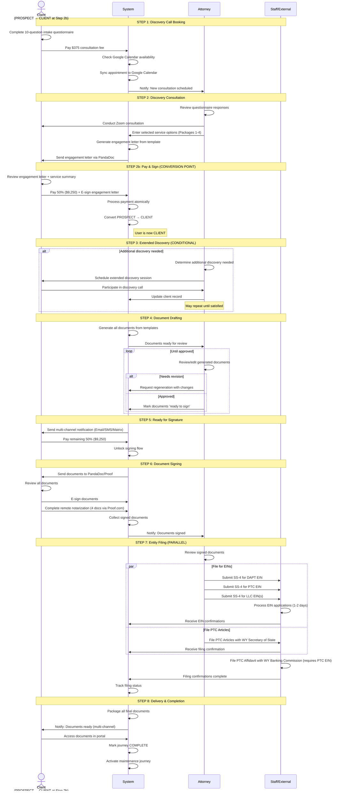

# Journeys & Workflows

Journeys are the heart of service delivery. They break complex legal services into manageable steps that both attorneys and clients can track.

## Understanding Journey Steps

Each journey contains ordered steps. Steps come in two types:

### Milestone Steps

- Discrete, one-time completion points
- Shows a checkmark when completed
- Example: "Initial Consultation Complete" or "Documents Signed"

### Bridge Steps

- Iterative revision/feedback loops
- Allows multiple rounds of back-and-forth
- Example: "Trust Document Review" where client and attorney may go through several revisions
- Tracks iteration count and approval status from both parties

## Creating a Journey Template

1. Go to **Journeys** in the sidebar
2. Click **Create Journey**
3. Enter:
   - **Name**: e.g., "Wyoming Asset Protection Trust Journey"
   - **Description**: Overview of the workflow
   - **Associated Matter**: Link to the service offering
   - **Estimated Duration**: Total expected days
   - **Template**: Check this to make it reusable
4. Click **Create**

## Adding Steps to a Journey

1. Open your journey
2. Click **Add Step**
3. Configure the step:
   - **Name**: What this step accomplishes
   - **Type**: Milestone or Bridge
   - **Responsible Party**:
     - CLIENT: Client must complete
     - COUNSEL: Your staff completes
     - BOTH: Requires action from both parties
   - **Expected Duration**: Days for this step
   - **Help Content**: Instructions shown to the client
   - **Allow Multiple Iterations**: For Bridge steps
4. Click **Save**

## Reordering Steps

Drag and drop steps to change their order in the journey.

## Example: WYDAPT Journey

The pre-configured WYDAPT journey includes these steps:

| Order | Step | Type | Responsible |
|-------|------|------|-------------|
| 1 | Engagement & Initial Setup | Milestone | Both |
| 2 | Trust Formation - Review & Sign | Bridge | Both |
| 3 | Private Trust Company Setup | Milestone | Counsel |
| 4 | Special Purpose Trust (if applicable) | Milestone | Counsel |
| 5 | Investment Committee Formation | Milestone | Client |
| 6 | Asset Contribution Process | Bridge | Both |
| 7 | Distribution Management (Ongoing) | Bridge | Both |

## Monitoring Client Progress

From **Journeys**, you can see:

- All active client journeys
- Current step for each client
- Progress percentage
- Days in current step
- Priority level

Click into any journey to see detailed step-by-step status and take action.

---

## Detailed WYDAPT Journey Workflow

The following sequence diagram shows the complete end-to-end workflow for a Wyoming Asset Protection Trust (WYDAPT) service, including all interactions between the client, system, attorney, and staff.

> **Status**: Draft for attorney feedback
> **Created**: December 2024

### Service Details

- **Service**: Wyoming Asset Protection Trust (WYDAPT) - $18,500
- **Payment**: 50% at engagement ($9,250), 50% before signing ($9,250)
- **Consultation Fee**: $375 (non-refundable, not credited to service)
- **Conversion Point**: PROSPECT → CLIENT when engagement letter is signed AND first payment received

### Complete Journey Flow

### Step Details

#### Step 1: Discovery Call Booking (MILESTONE)

| Actor | Action | Type | Notes |
|-------|--------|------|-------|
| Client | Complete 10-question intake questionnaire | questionnaire | Prep for attorney |
| Client | Pay $375 consultation fee | payment | Non-refundable, standalone |
| System | Check Google Calendar availability | integration | Bi-directional sync |
| System | Sync booked appointment | integration | — |

**User Status**: LEAD/PROSPECT

---

#### Step 2: Discovery Consultation (MILESTONE)

| Actor | Action | Type | Notes |
|-------|--------|------|-------|
| Attorney | Review questionnaire responses | view | Pre-call prep |
| Attorney | Conduct Zoom consultation | offline | International client base |
| Attorney | Enter selected service options | data entry | Packages 1-4 |
| System | Generate engagement letter | document generation | Template with selections |
| System | Send for e-signature | e-sign | Via PandaDoc |

**Produces**: Engagement letter with selected packages

---

#### Step 2b: Pay & Sign (MILESTONE) — Conversion Point

| Actor | Action | Type | Notes |
|-------|--------|------|-------|
| Client | Review engagement letter + service cart | review | Combined UI |
| Client | Pay 50% ($9,250) | payment | — |
| Client | E-sign engagement letter | e-sign | — |
| System | Process payment + signature atomically | transaction | No partial states |
| System | Convert PROSPECT → CLIENT | status change | — |

**User Status**: CLIENT (after this step)

---

#### Step 3: Extended Discovery (BRIDGE — Conditional)

| Actor | Action | Type | Notes |
|-------|--------|------|-------|
| Attorney | Determine if additional discovery needed | decision | Professional judgment |
| Attorney | Schedule follow-up Zoom | calendar | If needed |
| Attorney | Conduct detailed design session | offline | — |
| Attorney | Update client record | data entry | — |

**Trigger**: Attorney discretion based on questionnaire quality and consultation outcome
**Iteration**: May repeat until attorney satisfied with design clarity
**Cost**: Included in flat fee — no additional billable

---

#### Step 4: Document Drafting (BRIDGE)

| Actor | Action | Type | Notes |
|-------|--------|------|-------|
| System | Generate documents from templates | document generation | Uses collected client data |
| Attorney | Review generated documents | review | — |
| Attorney | Edit as needed | edit | — |
| Attorney | Approve for client | approval | — |

**Documents Generated** (varies by package selection):

| Document | Package | Signer(s) | Notarization |
|----------|---------|-----------|--------------|
| DAPT Trust Agreement | 1 | Client(s) | ✅ **Yes** |
| Certificate of Trust (DAPT) | 1 | TBD | ✅ **Yes** |
| Statutory Affidavit (DAPT) | 1 | TBD | ✅ **Yes** |
| NCSPT Declaration | 1 | Attorney | No |
| NCSPT Certificate of Trust | 1 | Attorney | No |
| PTC Articles of Organization | 2 | TBD | No |
| PTC Operating Agreement | 2 | TBD | No |
| PTC Statutory Affidavit | 2 | TBD | ✅ **Yes** |
| Holding Co LLC docs | 3 | TBD | No |
| Operating Co LLC docs | 3 | TBD | No |

**Notarization Summary**: 4 documents require remote online notarization via Proof.com. These should be handled in a single notary session if possible.

---

#### Step 5: Ready for Signature (MILESTONE)

| Actor | Action | Type | Notes |
|-------|--------|------|-------|
| Attorney | Mark document package "ready to sign" | approval | Triggers client notification |
| System | Send multi-channel notification | notification | Email, SMS, Matrix |
| Client | Receive notification | — | — |
| Client | Pay remaining 50% ($9,250) | payment | Required before signing |
| System | Unlock signing flow | gate | Payment must clear first |

---

#### Step 6: Document Signing (MILESTONE)

| Actor | Action | Type | Notes |
|-------|--------|------|-------|
| System | Send documents to e-sign platform | integration | PandaDoc or Proof.com |
| Client | Review all documents | review | In signing session |
| Client | E-sign documents | e-sign | All docs in one session |
| Client | Complete remote notarization | notarization | Via Proof.com — 4 documents |
| System | Collect signed documents | document management | — |
| System | Notify attorney | notification | — |

**Notarization Required** (4 documents, single session via Proof.com):
- DAPT Trust Agreement
- Certificate of Trust (DAPT)
- Statutory Affidavit (DAPT)
- PTC Statutory Affidavit

---

#### Step 7: Entity Filing (MILESTONE)

| Actor | Action | Dependency | Notes |
|-------|--------|------------|-------|
| Staff | Submit SS-4 for DAPT EIN | None | IRS online portal |
| Staff | Submit SS-4 for PTC EIN | None | IRS online portal |
| Staff | Submit SS-4 for LLC EIN(s) | None | IRS online portal |
| Staff | File PTC Articles | None | WY Secretary of State (manual portal) |
| Staff | File PTC Affidavit | **PTC EIN received** | WY Banking Commission |
| System | Track filing status | — | — |

**EIN Turnaround**: Target 1-2 business days

---

#### Step 8: Delivery & Completion (MILESTONE)

| Actor | Action | Type | Notes |
|-------|--------|------|-------|
| System | Package all final documents | document assembly | Signed + filed + confirmations |
| System | Notify client | notification | Multi-channel |
| Client | Access documents in portal | download | Virtual delivery only |
| System | Mark journey COMPLETE | status change | — |
| System | Activate maintenance journey | subscription | Starts 1-year clock |

---

### Related Journeys

This diagram covers the **initial WYDAPT formation journey**. A separate journey mapping is needed for:

- **Maintenance Package Journey** ($3,500/year)
  - Annual meeting minutes for PTC and LLCs
  - Annual report filings with WY Secretary of State
  - Distribution request processing
  - Committee service
  - Registered agent renewal
  - Phone consultations

The maintenance journey activates automatically when this journey completes.
