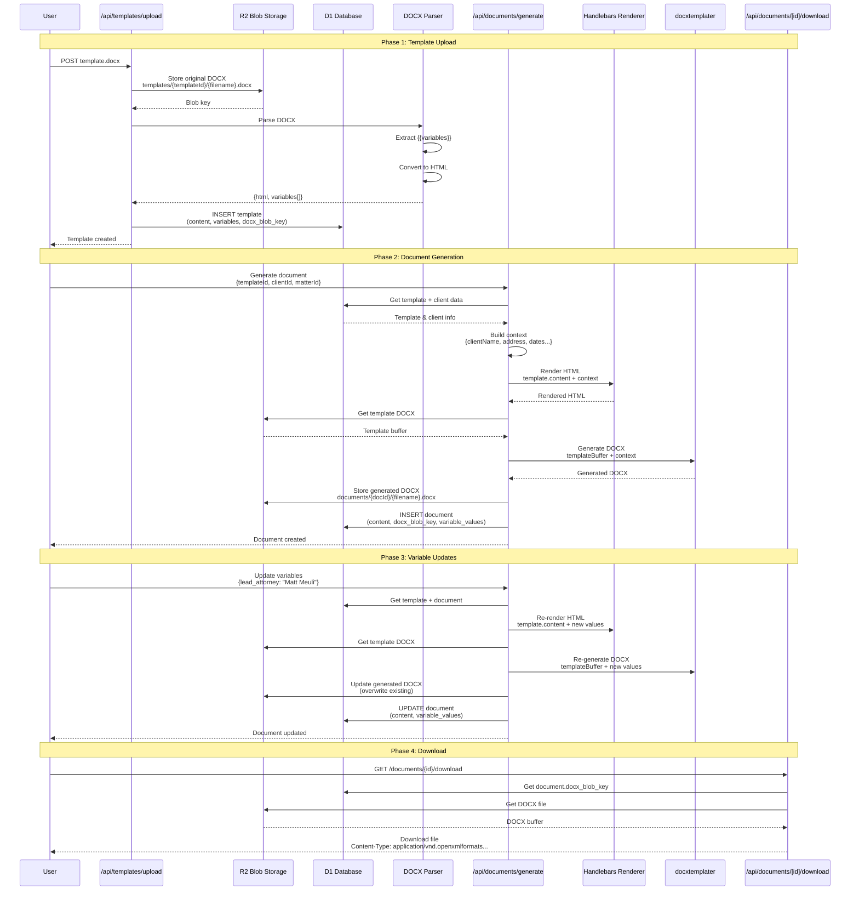
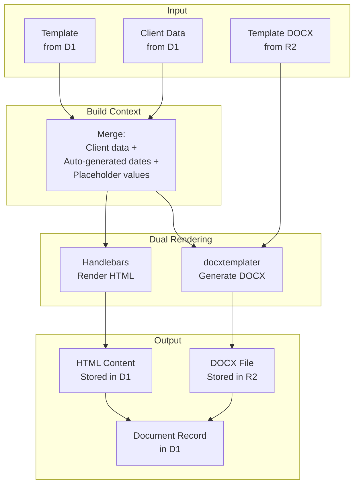
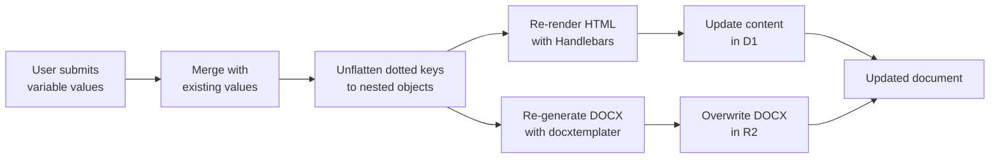

# Document Template System Architecture

## Overview

The Document Template System allows users to upload Word (.docx) templates with `{{variable}}` placeholders, generate personalized documents for clients, and download fully-formatted Word files. The system uses **Handlebars.js** for HTML preview rendering and **docxtemplater** for DOCX generation.

## Architecture



## Component Architecture

```mermaid
flowchart TB
    subgraph Client["Frontend (Vue/Nuxt)"]
        Upload[Template Upload<br/>Component]
        List[Templates List]
        Generate[Generate Document<br/>Modal]
        Detail[Document Detail<br/>Page]
        Form[Fill Variables<br/>Form]
        Download[Download Button]
    end

    subgraph API["API Endpoints"]
        UploadAPI[POST /api/templates/upload]
        ListAPI[GET /api/templates]
        GenAPI[POST /api/documents/generate]
        VarsAPI[POST /api/documents/[id]/variables]
        GetDocAPI[GET /api/documents/[id]]
        DownloadAPI[GET /api/documents/[id]/download]
        StatusAPI[PUT /api/documents/[id]/status]
    end

    subgraph Storage["Data Storage"]
        D1[(D1 Database<br/>Templates & Documents)]
        R2[R2 Blob Storage<br/>DOCX Files]
    end

    subgraph Utils["Processing Utilities"]
        DocxParser[docx-parser.ts<br/>Extract text & variables]
        HandlebarsUtil[template-renderer.ts<br/>Handlebars rendering]
        DocxGen[docx-generator.ts<br/>docxtemplater]
    end

    Upload -->|1. Upload| UploadAPI
    UploadAPI -->|2. Parse| DocxParser
    UploadAPI -->|3. Store| R2
    UploadAPI -->|4. Save metadata| D1

    List -->|5. Fetch| ListAPI
    ListAPI -->|6. Query| D1

    Generate -->|7. Generate| GenAPI
    GenAPI -->|8. Get template| D1
    GenAPI -->|9. Get DOCX| R2
    GenAPI -->|10. Render HTML| HandlebarsUtil
    GenAPI -->|11. Generate DOCX| DocxGen
    GenAPI -->|12. Store DOCX| R2
    GenAPI -->|13. Save doc| D1

    Detail -->|14. Get| GetDocAPI
    GetDocAPI -->|15. Query| D1

    Form -->|16. Update| VarsAPI
    VarsAPI -->|17. Get template| D1
    VarsAPI -->|18. Get template DOCX| R2
    VarsAPI -->|19. Re-render HTML| HandlebarsUtil
    VarsAPI -->|20. Re-generate DOCX| DocxGen
    VarsAPI -->|21. Update DOCX| R2
    VarsAPI -->|22. Update doc| D1

    Download -->|23. Download| DownloadAPI
    DownloadAPI -->|24. Get blob key| D1
    DownloadAPI -->|25. Get DOCX| R2

    style Client fill:#e1f5ff
    style API fill:#fff4e6
    style Storage fill:#e8f5e9
    style Utils fill:#f3e5f5
```

## Data Flow

### 1. Template Upload Flow

```mermaid
graph LR
    subgraph Input
        DOCX[User uploads<br/>template.docx<br/>with {{variables}}]
    end

    subgraph Upload["Upload Processing"]
        Validate[Validate file<br/>type & size]
        Parse[Parse DOCX<br/>Extract variables]
        StoreBlob[Store in R2<br/>templates/{id}/file.docx]
        ConvertHTML[Convert to HTML<br/>for preview]
    end

    subgraph Output["Stored Data"]
        BlobKey[R2 Blob Key<br/>templates/xyz/file.docx]
        TemplateRecord[D1 Template Record<br/>content, variables[], docx_blob_key]
    end

    DOCX --> Validate
    Validate --> Parse
    Parse --> StoreBlob
    Parse --> ConvertHTML
    StoreBlob --> BlobKey
    ConvertHTML --> TemplateRecord
    BlobKey --> TemplateRecord
```

### 2. Document Generation Flow



### 3. Variable Update Flow



## Database Schema

### document_templates table

```sql
CREATE TABLE document_templates (
  id TEXT PRIMARY KEY,
  name TEXT NOT NULL,
  description TEXT,
  category TEXT,

  -- Original DOCX stored in R2
  docx_blob_key TEXT,

  -- Parsed HTML content for preview
  content TEXT NOT NULL,

  -- Extracted variables as JSON array
  -- Example: ["clientName", "lead_attorney", "fee"]
  variables TEXT,

  -- Notarization requirement
  requires_notary INTEGER DEFAULT 0,

  created_at INTEGER NOT NULL,
  updated_at INTEGER NOT NULL
);
```

### documents table

```sql
CREATE TABLE documents (
  id TEXT PRIMARY KEY,
  title TEXT NOT NULL,
  description TEXT,
  status TEXT DEFAULT 'DRAFT',

  -- References
  template_id TEXT,
  matter_id TEXT,
  client_id TEXT NOT NULL,

  -- Rendered HTML content
  content TEXT,

  -- Generated DOCX stored in R2
  docx_blob_key TEXT,

  -- Variable values as JSON object
  -- Example: {"clientName": "John Doe", "lead_attorney": "Matt Meuli"}
  variable_values TEXT,

  -- Signature data
  signature_data TEXT,
  signed_at INTEGER,

  -- Status tracking
  viewed_at INTEGER,
  sent_at INTEGER,

  -- Timestamps
  created_at INTEGER NOT NULL,
  updated_at INTEGER NOT NULL,

  FOREIGN KEY (template_id) REFERENCES document_templates(id),
  FOREIGN KEY (matter_id) REFERENCES matters(id),
  FOREIGN KEY (client_id) REFERENCES users(id)
);
```

## Key Technologies

### 1. Handlebars.js
**Purpose**: HTML template rendering for browser preview

**Features**:
- `{{variable}}` syntax matching docxtemplater
- Custom helpers (formatDate, formatCurrency, etc.)
- Nested object support
- Conditionals and loops

**Example**:
```javascript
import Handlebars from 'handlebars'

const template = Handlebars.compile(`
  <p>Dear {{clientName}},</p>
  <p>Your fee is {{formatCurrency fee}}.</p>
`)

const html = template({
  clientName: 'John Doe',
  fee: 5000
})
```

### 2. docxtemplater
**Purpose**: Generate formatted Word documents

**Features**:
- Preserves all Word formatting (fonts, styles, tables, etc.)
- Custom delimiters configured to `{{` `}}`
- Nested object support via dot notation
- Loop and conditional support

**Example**:
```javascript
import Docxtemplater from 'docxtemplater'
import PizZip from 'pizzip'

const zip = new PizZip(templateBuffer)
const doc = new Docxtemplater(zip, {
  delimiters: { start: '{{', end: '}}' },
  paragraphLoop: true,
  linebreaks: true,
  nullGetter: () => ''
})

doc.render({
  clientName: 'John Doe',
  lead_attorney: 'Matt Meuli'
})

const output = doc.getZip().generate({ type: 'arraybuffer' })
```

### 3. DOCX Parser (Custom)
**Purpose**: Extract text and variables from uploaded DOCX

**Process**:
1. Unzip DOCX (ZIP archive)
2. Parse `word/document.xml` with fast-xml-parser
3. Extract text from `<w:t>` nodes
4. Find `{{variable}}` patterns with regex
5. Convert to HTML for preview

## Variable Handling

### Supported Variable Syntax

Only `{{variableName}}` is supported:
- ✅ `{{clientName}}`
- ✅ `{{lead_attorney}}`
- ✅ `{{fee}}`
- ❌ ~~`{{client.name}}`~~ (nested/dotted - NOT supported)

**Rationale**: docxtemplater with custom delimiters doesn't reliably support nested properties. Using flat variable names avoids complexity.

### Pre-filled Variables

When generating a document, the system automatically provides:

```javascript
const context = {
  // Client info (from database)
  clientFirstName: client.first_name,
  clientLastName: client.last_name,
  clientFullName: `${client.first_name} ${client.last_name}`,
  clientAddress: client.address,
  clientCity: client.city,
  clientState: client.state,
  clientZipCode: client.zip_code,
  clientEmail: client.email,
  clientPhone: client.phone,

  // Spouse info
  spouseName: client.spouse_name,

  // Service/Matter
  serviceName: template.name,
  matterName: body.matterName || template.name,

  // Auto-generated dates
  currentDate: new Date().toLocaleDateString('en-US', {
    year: 'numeric', month: 'long', day: 'numeric'
  }),
  today: '...',
  signatureDate: '...',

  // Placeholders
  fee: '$[To be determined]',
  retainerFee: '$[To be determined]',
  hourlyRate: '$[To be determined]',
  clientSignature: '[Signature Required]',

  // Custom data from form
  ...body.customData
}
```

### Variable Updates - Nested Object Conversion

When users update variables via the form, some variables may have dotted names. We convert flat keys to nested objects before rendering:

```javascript
// Flat keys (from form)
const flatVars = {
  'clientName': 'John Doe',
  'lead_attorney.full_name': 'Matt Meuli'  // From old template format
}

// Unflatten for Handlebars/docxtemplater
const nestedVars = {
  clientName: 'John Doe',
  lead_attorney: {
    full_name: 'Matt Meuli'
  }
}
```

**NOTE**: New templates should avoid dotted variable names entirely. Use flat names like `{{lead_attorney}}` instead of `{{lead_attorney.full_name}}`.

## API Endpoints

### Template Management

#### POST /api/templates/upload
Upload and process a new template

**Request**:
- `Content-Type: multipart/form-data`
- `file`: DOCX file
- `name` (optional): Custom template name
- `description` (optional): Template description
- `category` (optional): Template category

**Response**:
```json
{
  "template": {
    "id": "xyz123",
    "name": "Engagement Agreement",
    "category": "ENGAGEMENT_LETTER",
    "variables": ["clientName", "lead_attorney", "fee"],
    "docxBlobKey": "templates/xyz123/engagement.docx"
  }
}
```

#### GET /api/templates
List all templates

**Response**:
```json
{
  "templates": [
    {
      "id": "xyz123",
      "name": "Engagement Agreement",
      "category": "ENGAGEMENT_LETTER",
      "variablesCount": 12,
      "createdAt": 1704844800000
    }
  ]
}
```

### Document Generation

#### POST /api/documents/generate-from-template
Generate a new document from a template

**Request**:
```json
{
  "templateId": "xyz123",
  "clientId": "client_abc",
  "matterId": "matter_123",
  "title": "Engagement Agreement - John Doe",
  "customData": {
    "lead_attorney": "Matt Meuli",
    "fee": "$5,000"
  }
}
```

**Response**:
```json
{
  "document": {
    "id": "doc_789",
    "title": "Engagement Agreement - John Doe",
    "status": "DRAFT",
    "docxBlobKey": "documents/doc_789/engagement.docx"
  }
}
```

### Document Updates

#### POST /api/documents/[id]/variables
Update variable values and regenerate document

**Request**:
```json
{
  "variables": {
    "lead_attorney": "Matt Meuli",
    "fee": "$5,000",
    "retainerFee": "$2,500"
  }
}
```

**Response**:
```json
{
  "success": true,
  "document": {
    "id": "doc_789",
    "content": "<p>Updated HTML...</p>",
    "variables": {...}
  }
}
```

#### PUT /api/documents/[id]/status
Update document status

**Request**:
```json
{
  "status": "SENT"
}
```

**Valid statuses**: `DRAFT`, `SENT`, `VIEWED`, `SIGNED`, `COMPLETED`

### Document Download

#### GET /api/documents/[id]/download
Download the generated DOCX file

**Response**:
- `Content-Type: application/vnd.openxmlformats-officedocument.wordprocessingml.document`
- `Content-Disposition: attachment; filename="document.docx"`
- Binary DOCX data

## Performance Characteristics

### Template Upload
- **File size**: Typically 100KB - 1MB
- **Parse time**: ~100-500ms
- **Storage**: R2 + D1 metadata
- **Total time**: <1 second

### Document Generation
- **HTML rendering**: ~50-100ms (Handlebars)
- **DOCX generation**: ~200-500ms (docxtemplater)
- **Storage**: R2 for DOCX, D1 for HTML
- **Total time**: <1 second

### Variable Updates
- **Re-render HTML**: ~50-100ms
- **Re-generate DOCX**: ~200-500ms
- **Update storage**: ~100ms
- **Total time**: <1 second

### Download
- **Blob fetch**: ~50-100ms
- **Transfer**: Depends on file size (~500KB typical)
- **Total time**: <500ms for typical document

## Error Handling

### Upload Errors
- Invalid file type → 400 error with message
- File too large → 413 error
- Parse failure → 500 error, log details

### Generation Errors
- Template not found → 404 error
- Client not found → 404 error
- Render failure → 500 error, log template + data

### Download Errors
- Document not found → 404 error
- DOCX blob missing → 404 with helpful message
- Authorization failure → 403 error

## Security Considerations

1. **File Upload Validation**
   - Check MIME type
   - Limit file size (10MB max)
   - Scan for malicious content

2. **Authorization**
   - Only LAWYER/ADMIN roles can upload templates
   - Only LAWYER/ADMIN can generate documents
   - Clients can only view their own documents
   - Enforce role checks on all endpoints

3. **Blob Storage Security**
   - Use unique, unpredictable blob keys
   - Implement signed URLs for downloads (future)
   - Regular cleanup of orphaned blobs

4. **Data Sanitization**
   - Escape HTML in rendered content
   - Validate variable names (no SQL injection)
   - Sanitize file names

## Monitoring & Logging

```javascript
// Template upload
console.log('[Upload] Template uploaded:', {
  templateId,
  variablesCount,
  blobKey,
  duration: Date.now() - startTime
})

// Document generation
console.log('[Generate] Document generated:', {
  documentId,
  templateId,
  clientId,
  htmlSize: renderedContent.length,
  docxSize: generatedDocx.byteLength
})

// Variable updates
console.log('[Variables] Document updated:', {
  documentId,
  variablesUpdated: Object.keys(variables).length,
  htmlRegenerated: true,
  docxRegenerated: true
})

// Download
console.log('[Download] DOCX downloaded:', {
  documentId,
  fileSize: fileData.byteLength,
  userId: user.id
})
```

## Future Enhancements

1. **Template Versioning**
   - Track template changes
   - Allow documents to reference specific versions
   - Migration tools for updating documents

2. **Advanced Formatting**
   - Support for complex tables
   - Image placeholders
   - Conditional sections
   - Repeating blocks (loops)

3. **Collaboration**
   - Multiple users can edit variables
   - Comments on documents
   - Change tracking

4. **Automation**
   - Auto-generate documents on matter creation
   - Scheduled document generation
   - Bulk generation for multiple clients

5. **Integration**
   - E-signature integration (DocuSign, etc.)
   - Email delivery
   - Cloud storage sync (Google Drive, Dropbox)

6. **Analytics**
   - Template usage statistics
   - Document completion rates
   - Time-to-signature metrics
