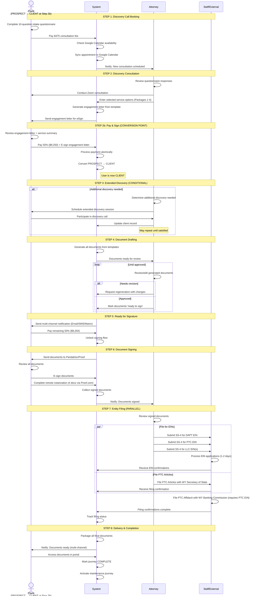

# WYDAPT Journey Workflow - Draft for Review

> **Status**: Draft for attorney feedback  
> **Created**: December 2024  
> **Open questions**: Highlighted with ❓ below

## Journey Overview

- **Service**: Wyoming Asset Protection Trust (WYDAPT) - $18,500
- **Payment**: 50% at engagement ($9,250), 50% before signing ($9,250)
- **Consultation Fee**: $375 (non-refundable, not credited to service)
- **Conversion Point**: PROSPECT → CLIENT when engagement letter is signed AND first payment received

---

## Workflow Diagram

---

## Step Details

### Step 1: Discovery Call Booking (MILESTONE)

| Actor | Action | Type | Notes |
|-------|--------|------|-------|
| Client | Complete 10-question intake questionnaire | questionnaire | Prep for attorney |
| Client | Pay $375 consultation fee | payment | Non-refundable, standalone |
| System | Check Google Calendar availability | integration | Bi-directional sync |
| System | Sync booked appointment | integration | — |

**User Status**: LEAD/PROSPECT  
❓ **Open**: Can questionnaire and payment happen in any order, or is there a required sequence?

---

### Step 2: Discovery Consultation (MILESTONE)

| Actor | Action | Type | Notes |
|-------|--------|------|-------|
| Attorney | Review questionnaire responses | view | Pre-call prep |
| Attorney | Conduct Zoom consultation | offline | International client base |
| Attorney | Enter selected service options | data entry | Packages 1-4 |
| System | Generate engagement letter | document generation | Template with selections |
| System | Send for e-signature | e-sign | internal e-sign |

**Produces**: Engagement letter with selected packages

---

### Step 2b: Pay & Sign (MILESTONE) — Conversion Point

| Actor | Action | Type | Notes |
|-------|--------|------|-------|
| Client | Review engagement letter + service cart | review | Combined UI |
| Client | Pay 50% ($9,250) | payment | — |
| Client | E-sign engagement letter | e-sign | — |
| System | Process payment + signature atomically | transaction | No partial states |
| System | Convert PROSPECT → CLIENT | status change | — |

**User Status**: CLIENT (after this step)  
❓ **Open**: For married couples, do both spouses sign same letter? One payment or two?

---

### Step 3: Extended Discovery (BRIDGE — Conditional)

| Actor | Action | Type | Notes |
|-------|--------|------|-------|
| Attorney | Determine if additional discovery needed | decision | Professional judgment |
| Attorney | Schedule follow-up Zoom | calendar | If needed |
| Attorney | Conduct detailed design session | offline | — |
| Attorney | Update client record | data entry | — |

**Trigger**: Attorney discretion based on questionnaire quality and consultation outcome  
**Iteration**: May repeat until attorney satisfied with design clarity  
**Cost**: Included in flat fee — no additional billable

---

### Step 4: Document Drafting (BRIDGE)

| Actor | Action | Type | Notes |
|-------|--------|------|-------|
| System | Generate documents from templates | document generation | Uses collected client data |
| Attorney | Review generated documents | review | — |
| Attorney | Edit as needed | edit | — |
| Attorney | Approve for client | approval | — |

**Documents Generated** (varies by package selection):

| Document | Package | Signer(s) | Notarization |
|----------|---------|-----------|--------------|
| DAPT Trust Agreement | 1 | Client(s) | ✅ **Yes** |
| Certificate of Trust (DAPT) | 1 | ❓ | ✅ **Yes** |
| Statutory Affidavit (DAPT) | 1 | ❓ | ✅ **Yes** |
| NCSPT Declaration | 1 | Attorney | No |
| NCSPT Certificate of Trust | 1 | Attorney | No |
| PTC Articles of Organization | 2 | ❓ | No |
| PTC Operating Agreement | 2 | ❓ | No |
| PTC Statutory Affidavit | 2 | ❓ | ✅ **Yes** |
| Holding Co LLC docs | 3 | ❓ | No |
| Operating Co LLC docs | 3 | ❓ | No |

**Notarization Summary**: 4 documents require remote online notarization via Proof.com. These should be handled in a single notary session if possible.

❓ **Open**: Do clients review drafts before signing and request changes?  
❓ **Open**: When is grantor vs. non-grantor trust determined?

---

### Step 5: Ready for Signature (MILESTONE)

| Actor | Action | Type | Notes |
|-------|--------|------|-------|
| Attorney | Mark document package "ready to sign" | approval | Triggers client notification |
| System | Send multi-channel notification | notification | Email, SMS, Matrix |
| Client | Receive notification | — | — |
| Client | Pay remaining 50% ($9,250) | payment | Required before signing |
| System | Unlock signing flow | gate | Payment must clear first |

---

### Step 6: Document Signing (MILESTONE)

| Actor | Action | Type | Notes |
|-------|--------|------|-------|
| System | Send documents to e-sign platform | integration | PandaDoc or Proof.com |
| Client | Review all documents | review | In signing session |
| Client | E-sign documents | e-sign | All docs in one session |
| Client | Complete remote notarization | notarization | Via Proof.com — 4 documents |
| System | Collect signed documents | document management | — |
| System | Notify attorney | notification | — |

**Notarization Required** (4 documents, single session via Proof.com):
- DAPT Trust Agreement
- Certificate of Trust (DAPT)
- Statutory Affidavit (DAPT)
- PTC Statutory Affidavit

**Note**: Confirm Proof.com supports multiple documents in one notary appointment.

---

### Step 7: Entity Filing (MILESTONE)

| Actor | Action | Dependency | Notes |
|-------|--------|------------|-------|
| Staff | Submit SS-4 for DAPT EIN | None | IRS online portal |
| Staff | Submit SS-4 for PTC EIN | None | IRS online portal |
| Staff | Submit SS-4 for LLC EIN(s) | None | IRS online portal |
| Staff | File PTC Articles | None | WY Secretary of State (manual portal) |
| Staff | File PTC Affidavit | **PTC EIN received** | WY Banking Commission |
| System | Track filing status | — | — |

**EIN Turnaround**: Target 1-2 business days  
❓ **Open**: Confirm all filing dependencies — is EIN required only for Banking Commission, or others too?

---

### Step 8: Delivery & Completion (MILESTONE)

| Actor | Action | Type | Notes |
|-------|--------|------|-------|
| System | Package all final documents | document assembly | Signed + filed + confirmations |
| System | Notify client | notification | Multi-channel |
| Client | Access documents in portal | download | Virtual delivery only |
| System | Mark journey COMPLETE | status change | — |
| System | Activate maintenance journey | subscription | Starts 1-year clock |

❓ **Open**: What exactly is in the final document package?  
❓ **Open**: Is there guidance/manual content for client on "what's next" (funding the trust, etc.)?

---

## Open Questions Summary

| # | Question | Affects |
|---|----------|---------|
| 1 | Questionnaire/payment sequence in booking? | Step 1 flow |
| 2 | Multiple signers — how do couples sign? One payment or two? | Steps 2b, 5, 6 |
| 3 | Do clients review drafts before signing? | Step 4 type (add review cycle?) |
| 4 | When is grantor vs. non-grantor determined? | Document generation |
| 5 | Who signs each document (besides DAPT Trust Agreement = Client)? | Step 6 signing flow |
| 6 | Confirm filing dependencies | Step 7 sequencing |
| 7 | What's in the final document package? | Step 8 assembly |
| 8 | Guidance content for clients post-delivery? | Step 8 / site content |

**Resolved**: Notarization requirements confirmed — 4 documents require notarization (DAPT Trust Agreement, Certificate of Trust, Statutory Affidavit DAPT, PTC Statutory Affidavit)

---

## Related Journeys

This diagram covers the **initial WYDAPT formation journey**. A separate journey mapping is needed for:

- **Maintenance Package Journey** ($3,500/year)
  - Annual meeting minutes for PTC and LLCs
  - Annual report filings with WY Secretary of State
  - Distribution request processing
  - Committee service
  - Registered agent renewal
  - Phone consultations

The maintenance journey activates automatically when this journey completes.